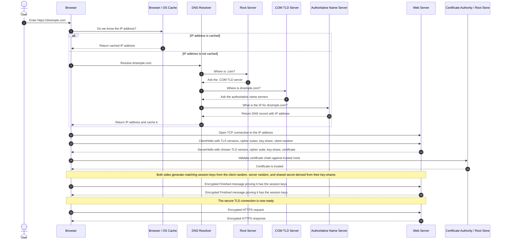

# Notes from DNS Simple Comics

1. [How HTTPS Works!](./how-https-works.md)
2. [How DNS Works](./how-dns-works.md)

## Journey of a Request

**TLS Handshake Clarifications:**

* The browser and server each create a temporary private/public key pair for this connection.

* The **key-share** is the public part of that temporary key pair.
  * Browser sends its public key-share to the server.
  * Server sends its public key-share to the browser.
  * Their private keys are never sent over the network.

* Both sides use Diffie-Hellman style math to generate the same **shared secret**:
  * Browser uses its private key + server's public key-share.
  * Server uses its private key + browser's public key-share.
  * An eavesdropper can see both public key-shares, but cannot calculate the shared secret without a private key.

* The **session keys** are generated from the shared secret plus handshake data like the client random, server random, and the handshake transcript.
  * The **handshake transcript** is the ordered record of the actual handshake messages exchanged so far, such as `ClientHello`, `ServerHello`, and the server certificate.
  * Including it ties the generated keys to this exact TLS negotiation and helps detect if any handshake message was changed.
  * Session keys are also never sent over the network.
  * They are symmetric keys, meaning both sides use matching keys to encrypt and decrypt the HTTPS traffic.

* The **Finished** messages prove both sides generated the same session keys.
  * The browser sends an encrypted/authenticated summary of the handshake.
  * The server verifies it using its own session keys.
  * Then the server does the same, and the browser verifies it.
  * If verification succeeds on both sides, the TLS connection is secure and ready for HTTPS.

## References

* [DNS Simple](https://dnsimple.com/comics)
* [**Cloudfare**](https://www.cloudflare.com/en-gb/learning/): The Cloudflare learning blogs are really good.
  * Learn about SSL
  * Learn about DNS
  * Other Blogs