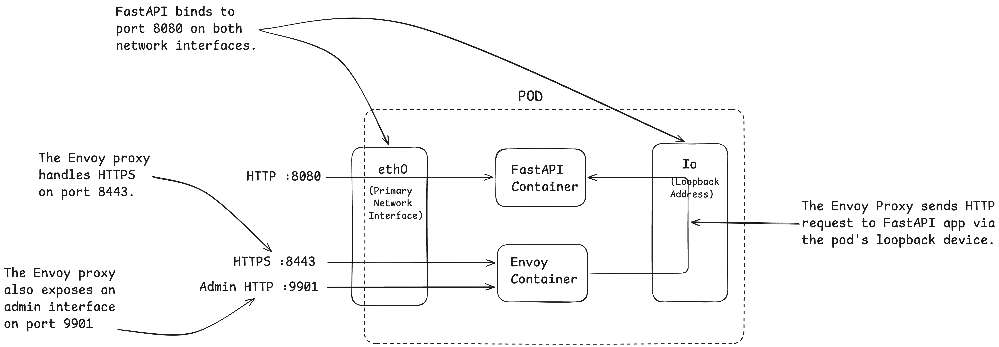

# Exetending Kiada FastAPI app using Envoy Proxy

Adding TLS support to the app so that it can also serve clients over HTTPS.

Even the FastAPI app can be configured to do so, but an easier option is to add a reverse proxy (like Envoy) in front of the app that can receive HTTPS requests on behalf of the application.

Also I am doing this to try running multiple containers in a pod.

So the new architecture of the app looks like:



More about this in Chapter 8.

Read the [deployment.yaml manifest](../../manifests/deployment.yaml) to know more. To test the changes:

```shell
curl -L https://127.0.0.1:8443 --insecure
# OR
curl -Lk https://127.0.0.1:8443
# ^^^short for `--insecure`` flag is `-k` flag

Kiada version 0.1.0
Request processed by "kiada-74987687d8-k5b95"
Client IP: 127.0.0.1
```

> NOTE: If it does not work, try deleting the LoadBalancer Service and re-deploying.
> `cloud-provider-kind` doesn't reliably update the port mapping, if ports are added later.

>>We are using a local CLI tool [`cloud-provider-kind`](https://kind.sigs.k8s.io/docs/user/loadbalancer/) to provision the LoadBalancer in the `kind` cluster.


## Why use the --insecure option?

> Copied from the book

There are two reasons to use the `--insecure` option when accessing the service. The certificate used by the Envoy proxy is self-signed and was issued for the domain name `example.com`. You’re accessing the service through localhost, where the local kubectl proxy process is listening. Therefore, the hostname doesn’t match the name in the server certificate.

To make the names match, you can tell curl to send the request to example.com, but resolve it to 127.0.0.1 with the `--resolve` flag. This will ensure that the certificate matches the requested URL, but since the server’s certificate is self-signed, curl will still not accept it as valid. You can fix the problem by telling curl the certificate to use to verify the server with the `--cacert` flag. The whole command then looks like this:

```shell
curl https://example.com:8443 --resolve example.com:8443:127.0.0.1 --cacert kiada-ssl-proxy-0.1/example-com.crt
```
