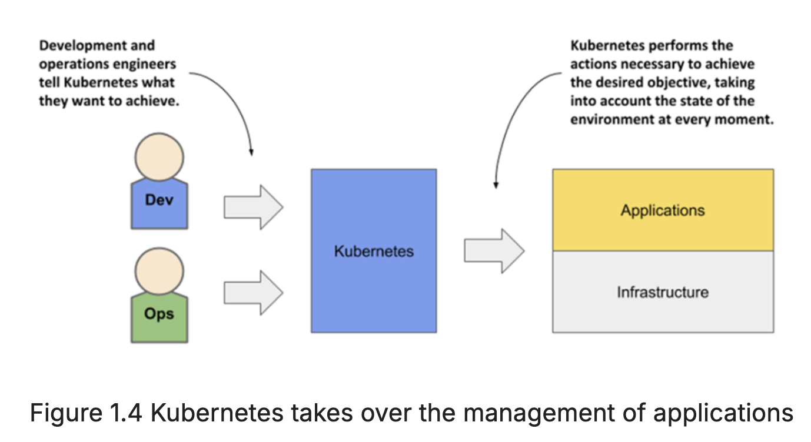
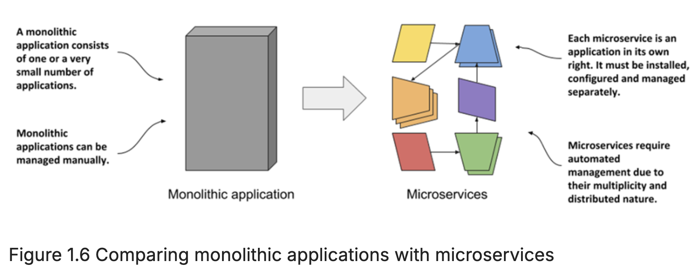
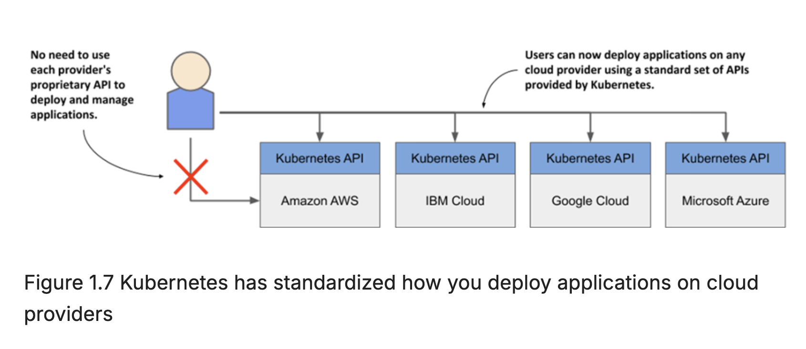
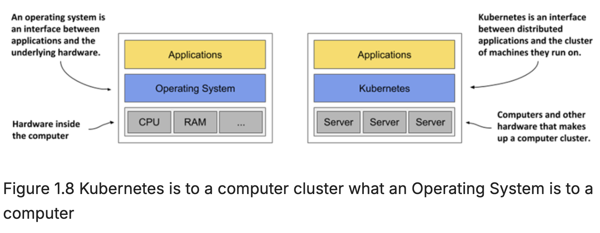
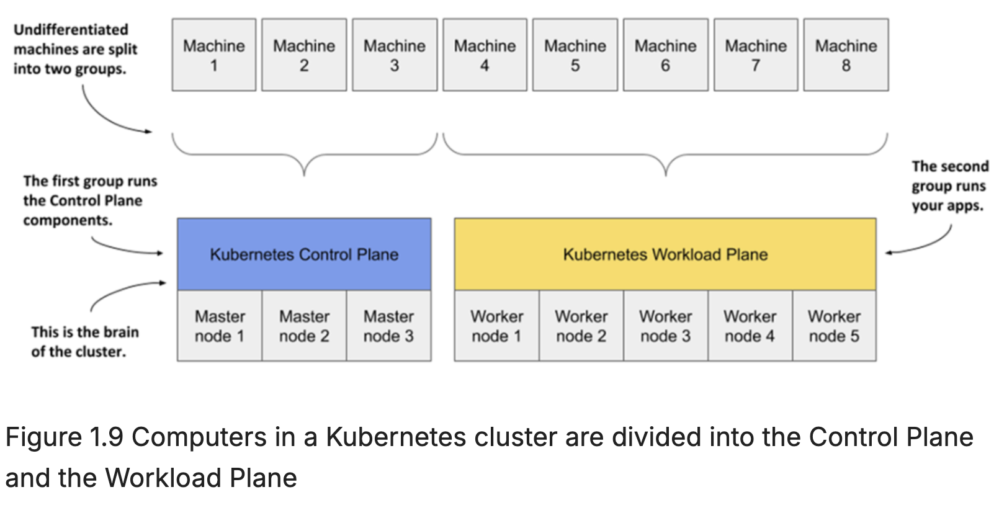

# Kubernetes (K8s)

* Kubernetes is software system for automating the deployment & management of complex, large-scale applications running inside containers.

* It uses a declarative model – you descibe the components of your application and Kubernetes turns it into a running application.
  * It takes care of the underlying infrastructure be it on-prem or cloud resources
  * If the app fails, Kubernetes will automatically restart it.
  * If the hardware fails or the infrastructure topology changes so that the application needs to be moved to other machines, Kubernetes does this all by itself.
  * If you update the app components, it figures out the necessary steps to reconfigure the running app.

## From Monoliths to Microservices

Monoliths:

* In past most applications were large monoliths, i.e., different components of the applications were tightlity coupled, and they ran on a single compute instance.

* Deployments was staright forward, you install the app on a single poweful computer with whatever little cofiguration it required.

* Scaling the application horizontally was rarely possible, so whenever you needed to increase the capacity of the application, you had to upgrade the hardware - in other words, scale the application vertically.

Microservices:

* Then came the new architecture style called microservices, where the application is broken down into smaller, independent services that communicate with each other over well-defined APIs.

* Dependency Hell: Since each microservice is a individually managed application, it may have its own set of dependencies(even conflicting versions of libraries), runtime environments, and configurations. 

* So, running the two apps in the same OS becomes a challenge. This is where containers help.

* Containers help to package each microservice along with its dependencies, ensuring consistency across different environments.

* Individual parts of the entire application no longer need to run on the same computer, which makes it easier to scale the entire system, but also means that the applications need to be configured to communicate with each other.

* When the system consists of many microservices, automated management is crucial. Kubernetes provides this automation.

## Cloud Agnostic

With the rise of moving apps from on-prem to cloud, Kubernetes provides a cloud-agnostic way to manage applications avoiding vendor lock-in.

If the application is built on the APIs of Kubernetes instead of directly on the proprietary APIs of a specific cloud provider, it can be transferred relatively easily to any other provider.

## Understanding Kubernetes

* Kubernetes is what an OS is to a computer, it is what a cluster of compters is to running applications.

* Just like an OS helps the app running on a single computer talk to the hardware, Kubernetes is an interface b/w the distributed applicationss and the underlying cluster of computers they run on.

* Just like an OS supports the basic functions of a computer - CPU management, memory managemet, file system access, networking, etc., Kubernetes provides similar functions for diff. components of a distributed applications running on a cluster of computers.

* This includes things like:
  * *service discovery* - a mechanism that allows applications to find other applications and use the services they provide,
  * *horizontal scaling* - replicating your application to adjust to fluctuations in load,
  * *load-balancing* - distributing load across all the application replicas,
  * *self-healing* - keeping the system healthy by automatically restarting failed applications and moving them to healthy nodes after their nodes fail,
  * *leader election* - a mechanism that decides which instance of the application should be active while the others remain idle but ready to take over if the active instance fails.

### How Kubernetes fits into a Cluster of Computers

* You start with a fleet of machines that you divide into two groups - *the master and the worker nodes*.

  * The master nodes will run the Kubernetes Control Plane, which represents the brain of your system and controls the cluster,

  * while the rest will run your applications - your workloads - and will therefore represent the Workload Plane.

* Sometimes the workload plane is also called the data plane but it has nothing to do with hosting data.

* Non-production clusters may have a single master node, but highly available production clusters use atleast 3 physical master nodes to host the control plane.

  * The number of worker nodes depends on the number of applications you deploy.