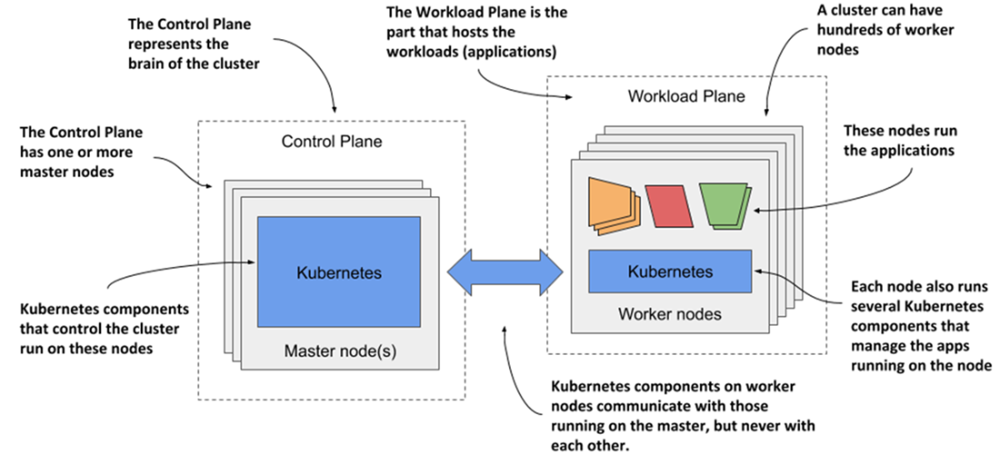
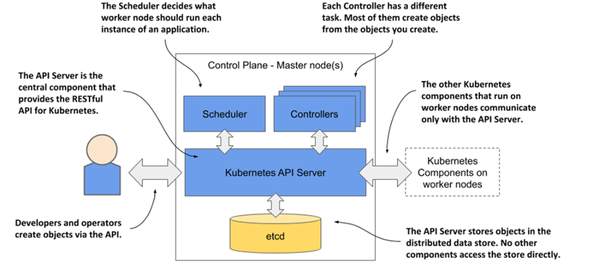
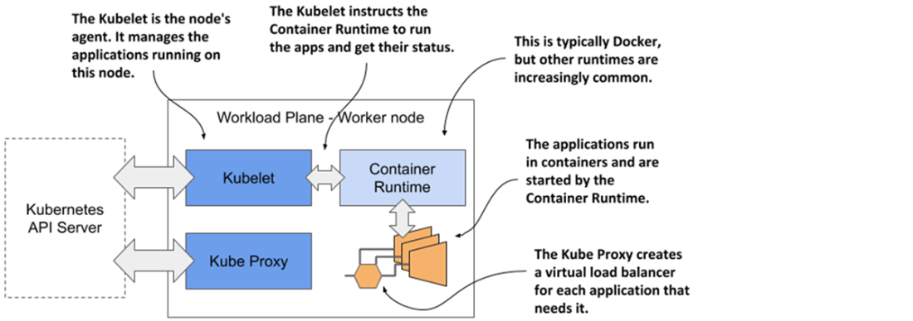
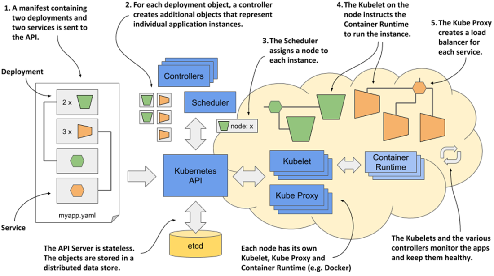

# Kubernetes (K8s)

* Kubernetes is software system for automating the deployment & management of complex, large-scale applications running inside containers.

* It uses a declarative model – you descibe the components of your application and Kubernetes turns it into a running application.
  * It takes care of the underlying infrastructure be it on-prem or cloud resources
  * If the app fails, Kubernetes will automatically restart it.
  * If the hardware fails or the infrastructure topology changes so that the application needs to be moved to other machines, Kubernetes does this all by itself.
  * If you update the app components, it figures out the necessary steps to reconfigure the running app.

## From Monoliths to Microservices

Monoliths:

* In past most applications were large monoliths, i.e., different components of the applications were tightlity coupled, and they ran on a single compute instance.

* Deployments was staright forward, you install the app on a single poweful computer with whatever little cofiguration it required.

* Scaling the application horizontally was rarely possible, so whenever you needed to increase the capacity of the application, you had to upgrade the hardware - in other words, scale the application vertically.

Microservices:

* Then came the new architecture style called microservices, where the application is broken down into smaller, independent services that communicate with each other over well-defined APIs.

* Dependency Hell: Since each microservice is a individually managed application, it may have its own set of dependencies(even conflicting versions of libraries), runtime environments, and configurations. 

* So, running the two apps in the same OS becomes a challenge. This is where containers help.

* Containers help to package each microservice along with its dependencies, ensuring consistency across different environments.

* Individual parts of the entire application no longer need to run on the same computer, which makes it easier to scale the entire system, but also means that the applications need to be configured to communicate with each other.

* When the system consists of many microservices, automated management is crucial. Kubernetes provides this automation.

## Cloud Agnostic

With the rise of moving apps from on-prem to cloud, Kubernetes provides a cloud-agnostic way to manage applications avoiding vendor lock-in.

If the application is built on the APIs of Kubernetes instead of directly on the proprietary APIs of a specific cloud provider, it can be transferred relatively easily to any other provider.

## Understanding Kubernetes

* Kubernetes is what an OS is to a computer, it is what a cluster of compters is to running applications.

* Just like an OS helps the app running on a single computer talk to the hardware, Kubernetes is an interface b/w the distributed applicationss and the underlying cluster of computers they run on.

* Just like an OS supports the basic functions of a computer - CPU management, memory managemet, file system access, networking, etc., Kubernetes provides similar functions for diff. components of a distributed applications running on a cluster of computers.

* This includes things like:
  * *service discovery* - a mechanism that allows applications to find other applications and use the services they provide,
  * *horizontal scaling* - replicating your application to adjust to fluctuations in load,
  * *load-balancing* - distributing load across all the application replicas,
  * *self-healing* - keeping the system healthy by automatically restarting failed applications and moving them to healthy nodes after their nodes fail,
  * *leader election* - a mechanism that decides which instance of the application should be active while the others remain idle but ready to take over if the active instance fails.

### How Kubernetes fits into a Cluster of Computers

* You start with a fleet of machines that you divide into two groups - *the master and the worker nodes*.

  * The master nodes will run the Kubernetes Control Plane, which represents the brain of your system and controls the cluster,

  * while the rest will run your applications - your workloads - and will therefore represent the Workload Plane.

* Sometimes the workload plane is also called the data plane but it has nothing to do with hosting data.

* Non-production clusters may have a single master node, but highly available production clusters use atleast 3 physical master nodes to host the control plane.

  * The number of worker nodes depends on the number of applications you deploy.

* After Kubernetes is installed on your computers(cluster), you no longer need to think about the individual computers when deploying apps.
  * Regardless of the number of worker nodes in the cluster, *they all become a single space* to deploy your apps.
  * You do this using Kubernetes APIs provided by the control plane.
  * This does not mean that you can deploy an extremely large application that is spread across all the worker nodes. Kubernetes doesn't do magic tricks like this.
  * Each app must be small enough to fit/run on a single worker node.
  * What is meant by saying that the worker nodes all become a single space is that you can deploy your apps without thinking which worker node the app will run on.

### The Benefits of using Kubernetes

1. **Self-service application deployment**
   
   Kubernetes abstracts all worker nodes into a single deployment surface, allowing developers to deploy applications independently without worrying about node details or infrastructure decisions.

2. **Improved infrastructure utilization and cost reduction**
   
   By intelligently scheduling and moving workloads across nodes, Kubernetes optimizes resource usage, enabling more applications to run on fewer servers.

3. **Automatic scaling to handle changing load**
   
   Kubernetes monitors application resource usage and automatically scales application instances up or down. In cloud environments, it can also provision new nodes when needed.

4. **Self-healing and high availability**
   
   Kubernetes automatically restarts failed applications and reschedules workloads when nodes fail, minimizing downtime and reducing the need for manual intervention.

5. **Simplified Application development**
   
   Kubernetes provides built-in infrastructure services such as service discovery, leader election, and centralized configuration, reducing complexity in application code while still allowing API access when needed.

## The Architecture of a Kubernetes Cluster

K8s consists of nodes divided into 2 groups:

1. A set of *control plane nodes* to host the control plane components, which are the brains of the system, since they control the entire cluster.

2. A set of *worker nodes* that form the workload plane, which is where your workloads (or applications) run.

### Control Plane Components

The Control Plane is what controls the cluster. It runs on a single node or replicated across multiple nodes to ensure high availability.

1. **Kubernetes API Server** – exposes the RESTful Kubernetes API. This is used by devs and other K8s componentes to create objects.

2. **etcd** – distribured datastore persists the objects created through the API, since the API server itself is stateless. The server is the only component that talks to etcd

3. **Scheduler** – decides on which worker node each application instance should run.

4. **Controllers** – bring to life the objects created through the API. Most of them simply create other objects, but some also communicate with external systems (for example, the cloud provider via its API).

In Kubernetes, **objects** are persistent entities that represent the desired state of something in the cluster. You create and update them via the API (YAML or `kubectl`); the API server stores them in etcd, and controllers then work to make the cluster match that state.

**Examples of Kubernetes objects:**

| Object | Purpose |
|--------|--------|
| **Pod** | Smallest deployable unit; one or more containers that run together on a node. |
| **Deployment** | Declares how many replicas of a Pod to run and how to roll out updates. Controllers create/update Pods to match. |
| **Service** | Stable network identity and load-balancing for a set of Pods (e.g. “my-api” on a fixed name and port). |
| **ConfigMap** | Key-value config (or files) you can mount into Pods. |
| **Secret** | Sensitive data (passwords, tokens) stored and mounted into Pods. |
| **Namespace** | Logical grouping of objects (like “dev”, “prod”) for isolation and organization. |
| **Ingress** | Rules for HTTP(S) routing into the cluster (host/path → Services). |
| **PersistentVolumeClaim (PVC)** | Request for storage; the cluster provisions or binds a PersistentVolume. |

So when the notes say “create objects through the API” and “controllers bring them to life,” they mean: you create objects like a **Deployment**; etcd stores it; a controller sees it and creates **Pods** (and maybe other objects); the **Scheduler** assigns those Pods to nodes. The “objects” are these API resources (Deployment, Pod, Service, etc.).

### Worker Node Components

Worker Nodes are the computers on which your apps run. They form the cluster's workload plane. In addition to the applications, the workload plane also hosts other components that perform the task of running, monitoring, and providing connectivity b/w your applications.

Each node runs the following set of components:

1. **Kubelet** – an agent that talks to the API server and manages the applications running on its node. It reports the status of these applications and the node via the API.

2. **Container runtime** – which can be Docker or any other runtime compatible with Kubernetes. It runs your applications in containers as instructed by the Kubelet.

3. **Kubernetes Service Proxy (kube-proxy)** – load-balances network traffic between applications.

4. Most Kubernetes clusters also contains serveral other components – a DNS server, network plugins, logging agents, and many others. They typically run on the worker nodes but can be run on the control plane nodes as well.

## How to deploy an application in Kubernetes – General Overview

The following actions take place when you deploy the application:

1. You submit the application manifest to the Kubernetes API. The API Server writes the objects defined in the manifest to etcd.

2. A controller notices the newly created objects and creates several new objects—one for each application instance.

3. The scheduler assigns a node to each instance.

4. The Kubelet notices that an instance is assigned to the Kubelet’s node. It runs the application instance via the container runtime.

5. The kube-proxy notices that the application instances are ready to accept connections from clients and configures a load balancer for them.

6. The Kubelets and the controllers monitor the system and keep the applications running.

* **

### 1. Applications Are Defined as Kubernetes Objects

* Everything in Kubernetes is represented as an **object** managed through the Kubernetes API.

* An application consists of multiple object types, such as:

  * A deployment object (represents the application as a whole)
  * Instance objects (represent running application instances)
  * Service objects (provide a single IP address/load-balanced access)

* These objects are defined in **YAML or JSON manifest files**.

* When submitted, the API Server:

  * Validates the objects
  * Stores them in **etcd**
  * Notifies other components (like controllers)

### 2. Controllers Bring Objects to Life

* Most object types have an associated **controller**.

* Controllers:
  * Watch for new objects via API notifications
  * Create additional objects as needed
  * Example – A Deployment controller creates instance objects (based on the specified replica count).

* Controllers continuously work to move the system toward the desired state defined in the objects.

### 3. The Scheduler Assigns Instances to Nodes

* The scheduler is a specialized controller.

* Its only responsibility is to:

  * Select the best worker node for each application instance
  * Update the instance object with the assigned node

* It makes scheduling decisions based on cluster state and resource availability.

### 4. The Kubelet Runs Applications on Worker Nodes

* Each worker node runs a **Kubelet**, which acts as a node-level controller.

* The Kubelet:

  * Watches for instances assigned to its node
  * Instructs the **container runtime** to start the container
  * Monitors application health
  * Restarts containers if they fail
  * Updates the instance status in the API

### 5. kube-proxy Enables Load Balancing and System Health

* When multiple application instances exist, **kube-proxy**:

  * Sets up a load balancer
  * Exposes the instances via a single IP address

* Ongoing system health:

  * Kubelets restart failed containers
  * Controllers monitor instance status
  * Applications are rescheduled if nodes fail

* The system continuously works to maintain the declared desired state.

### Overall Flow of Deployment

1. Submit manifest → API stores objects in etcd.
2. Controllers create instance objects.
3. Scheduler assigns nodes.
4. Kubelets start containers via the container runtime.
5. kube-proxy configures load balancing.
6. Controllers and Kubelets continuously monitor and maintain health.

