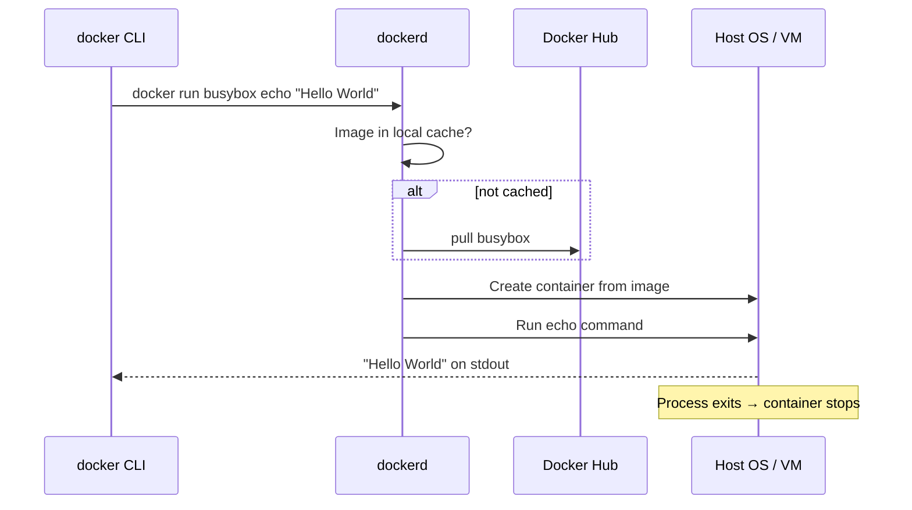

# Chapter 2 Revision: Containers & Containerized Applications

## 1. Why Containers Exist

**The problem chain:**

```
Microservices → Many apps on one machine → Conflicting dependencies → VMs are too heavy → Containers
```

| Approach | Pros | Cons |
|----------|------|------|
| **One VM per app** | Strong isolation | Expensive, slow to start, hard to manage at scale |
| **Many apps on one OS** | Efficient | Dependency hell — conflicting libraries, runtimes, configs |
| **Containers** | Pack app + deps together, lightweight, fast | Weaker isolation than VMs (shared kernel) |

**Key insight:** When you have hundreds of microservice instances, VMs become too heavy. Containers are the lighter alternative Kubernetes builds on.

---

## 2. Containers vs Virtual Machines

```
┌─────────────────────────────────────────────────────────────────┐
│                         VIRTUAL MACHINES                        │
├─────────────────────────────────────────────────────────────────┤
│  App A    │  App B    │  App C                                  │
│  Guest OS │  Guest OS │  Guest OS    ← each has its own kernel  │
├───────────┴───────────┴─────────────────────────────────────────┤
│                    Hypervisor (virtualizes hardware)            │
├─────────────────────────────────────────────────────────────────┤
│                         Host Hardware                           │
└─────────────────────────────────────────────────────────────────┘

┌─────────────────────────────────────────────────────────────────┐
│                           CONTAINERS                            │
├─────────────────────────────────────────────────────────────────┤
│  App A    │  App B    │  App C    ← regular processes           │
├───────────┴───────────┴─────────────────────────────────────────┤
│              Container runtime (Docker, containerd, CRI-O)      │
├─────────────────────────────────────────────────────────────────┤
│              Host OS + ONE shared Linux kernel                  │
├─────────────────────────────────────────────────────────────────┤
│                         Host Hardware                           │
└─────────────────────────────────────────────────────────────────┘
```

| Dimension | VM | Container |
|-----------|-----|-----------|
| **Unit of isolation** | Full OS + kernel | Process + kernel features |
| **Startup** | Slow (boot OS) | Fast (start process) |
| **Overhead** | High (duplicate OS, extra processes) | Low (only app process) |
| **Isolation strength** | Strong (separate kernel) | Good, but shared kernel |
| **Memory** | Separate allocations | Shared host memory unless limited |
| **Hardware needed** | CPU virtualization + hypervisor | Linux kernel container features |

**Security trade-off:** A kernel vulnerability or rogue syscall in one container can potentially affect others. Only separate physical machines give full isolation.

**Memory warning:** Without limits, one container can exhaust host memory and harm others.

---

## 3. Images, Registries, and Containers

Three concepts — know how they relate:

```
┌──────────────┐     push/pull     ┌──────────────┐     docker run     ┌──────────────┐
│    IMAGE     │ ◄──────────────►  │   REGISTRY   │                    │  CONTAINER   │
│  (blueprint) │                   │  (storage)   │                    │  (running)   │
└──────────────┘                   └──────────────┘                    └──────────────┘
     build                              Docker Hub,                         process on
   from Dockerfile                     GHCR, private repos                  host OS
```

| Concept | What it is |
|---------|------------|
| **Image** | Packaged bundle: app + filesystem + metadata (entrypoint, ports, env) |
| **Registry** | Repository for storing/sharing images (public or private, like GitHub for images) |
| **Container** | A **running instance** of an image — an isolated process on the host |

**Image tags:** Same image name, different variants.

- `python:3.11`
- `python:3.11-slim-trixie` (smaller Debian-based variant)
- No tag specified → Docker assumes `latest`

---

## 4. Image Layers & Copy-on-Write

Images are built from **stacked layers**. Each Dockerfile instruction (`FROM`, `COPY`, `RUN`, etc.) creates a new layer.

```
┌─────────────────────────────────┐
│  Container R/W layer (unique)   │  ← writes go here
├─────────────────────────────────┤
│  App layer (COPY . /app)        │
├─────────────────────────────────┤
│ Dependencies layer (RUN uv sync)│
├─────────────────────────────────┤
│  Base image (python:3.12-slim)  │  ← shared across containers
└─────────────────────────────────┘
```

**Why layers matter:**

- Shared layers are downloaded/stored **once**
- Distribution is efficient — only missing layers get pulled
- Multiple images can reuse the same base layer

**Copy-on-Write (CoW):** When container A modifies a file in a read-only layer, the **entire file** is copied into that container's writable layer and changed there. Other containers don't see the change.

**Gotcha:** Even `chmod` or ownership changes copy the whole file. On large files, the writable layer can swell fast. Deleting files only marks them deleted — image size doesn't shrink.

**Image limitations:**

- The **Linux kernel is NOT bundled** in the image
- App needs a compatible host kernel (version, modules)
- Architecture must match: x86 image won't run on ARM (unless emulated)

> Containers bring their own **user-space** (Ubuntu tools on a Fedora host is fine), but they always use the **host kernel**.

---

## 5. What Happens When You Run a Container

```bash
docker run busybox echo "Hello World"
```



**Important architecture note:**

| Your OS | Where dockerd & containers run |
|---------|-------------------------------|
| **Linux** | Directly on host |
| **macOS / Windows** | Inside a Linux VM (Docker Desktop) |

So on Mac, when you "look at the host," you're often looking inside Docker Desktop's VM — which is why your PID experiments showed different numbers inside vs outside the container.

---

## 6. Building Images — Your Kiada Dockerfile

Your actual build in `kiada/Dockerfile`:

```dockerfile
FROM python:3.12-slim-trixie          # base layer
COPY --from=ghcr.io/.../uv /uv /bin/    # multi-stage copy
WORKDIR /app
COPY pyproject.toml README.md uv.lock   # dependency layer (cache-friendly)
RUN uv sync --locked                    # install deps → new layer
COPY . /app/                            # app code layer
CMD ["uv", "run", "uvicorn", ...]       # default startup command
```

**Build flow:**

1. CLI sends build context to **dockerd** (not built locally by CLI)
2. Daemon pulls base image if needed
3. Runs each Dockerfile instruction in order
4. Each instruction → new image layer
5. Final state tagged (e.g. `kiada:latest`)

**Tip from your notes:** Don't put unnecessary files in the build directory — the whole context gets sent to the daemon.

---

## 7. OCI, CRI, and the Runtime Landscape

Docker popularized containers, but **Docker doesn't provide isolation** — the **Linux kernel** does. Docker is a tool that uses kernel features.

```
┌─────────────────────────────────────────────────────────────┐
│                    STANDARDS & INTERFACES                   │
├─────────────────────────────────────────────────────────────┤
│  OCI Image Spec     → standard image format                 │
│  OCI Runtime Spec   → standard way to create/run containers │
│  CRI (in Kubernetes) → API for kubelet ↔ container runtime  │
├─────────────────────────────────────────────────────────────┤
│  Runtimes:  Docker │ containerd │ CRI-O │ Podman ...        │
└─────────────────────────────────────────────────────────────┘
```

**What this means for you:**

- Build images with Docker → run them in Kubernetes with **containerd** or **CRI-O**
- Kubernetes no longer talks to Docker directly; it uses CRI
- OCI compliance makes runtime choice mostly irrelevant

This connects directly to Chapter 3: kind nodes use **CRI-O** + `crictl`, not Docker inside the node.

---

## 8. How Containers Actually Work — Three Kernel Pillars

Containers aren't magic boxes. They're **regular Linux processes** with three layers of kernel enforcement:

```
┌─────────────────────────────────────────────────────────────┐
│              WHAT MAKES A CONTAINER A CONTAINER             │
├──────────────────┬──────────────────┬───────────────────────┤
│   NAMESPACES     │     CGROUPS      │   SECURITY HARDENING  │
│   (visibility)   │    (limits)      │   (privilege control) │
├──────────────────┼──────────────────┼───────────────────────┤
│ What can I see?  │ How much can I   │ What am I allowed to  │
│                  │ consume?         │ do to the kernel?     │
└──────────────────┴──────────────────┴───────────────────────┘
```

---

## 9. Linux Namespaces — Process-Level Isolation

**Namespaces partition kernel resources** so a process sees a virtualized slice of the system.

| Namespace | Type | Isolates |
|-----------|------|----------|
| **mnt** | Mount | Filesystem view (mount points) |
| **pid** | Process ID | Process tree — PID 1 inside container ≠ host PID |
| **net** | Network | Interfaces, IPs, ports, routing |
| **user** | User ID | UID/GID mapping — root inside ≠ root outside |
| **ipc** | IPC | Shared memory, message queues |
| **uts** | Hostname | System hostname and domain |
| **time** | Time | Clock offset |
| **cgroup** | Cgroup | View of cgroup hierarchy |

**Mental model:** A container is not enclosed like a VM. It's a process with **one namespace per resource type** assigned to it.

### PID namespace — your hands-on proof

Inside Kiada container:
```
PID 1 → uv run uvicorn ...
```

On Docker Desktop VM host:
```
PID 3974 → same uvicorn process
```

Same process, **two IDs** — because the container has its own PID namespace with its own process tree.

### Network & UTS namespaces

- **net:** Container gets its own network interface — can't tell it's in a container by looking at interfaces alone
- **uts:** Container gets its own hostname — Kiada returns this via `socket.gethostname()` in `/text` and `/html`

### Shared namespaces — preview of Pods

Related containers sometimes **share** namespaces:

```
Container A ──┐
              ├── shared NET namespace → same IP, talk via localhost (127.0.0.1)
Container B ──┘
              separate MNT namespace → different filesystems
```

This is a direct preview of **Pods** in Kubernetes: containers in a Pod often share network (and sometimes other namespaces).

> **Loopback address:** `127.0.0.1` — traffic to yourself, bypassing physical network hardware.

---

## 10. Your Kiada Lab — Exploring a Running Container

You built and explored Kiada — the book's demo app. Key commands from your notes:

```bash
# Run locally via Compose
docker compose up --build

# Shell into running container
docker exec -it kiada-container sh

# See processes inside (PID 1 = uvicorn)
ps aux

# See filesystem isolation
ls -lha /
ls -lha /app

# Monitor resource usage
docker stats kiada-container --no-stream
```

**Kiada is useful later** because it reports:

```python
{
    "version": "0.1.0",
    "hostname": "<container hostname>",   # changes per Pod in K8s
    "clientIP": "<client IP>"
}
```

When you deploy multiple replicas in Kubernetes, hitting `/text` shows **which Pod answered** — that's the payoff for understanding UTS/PID namespaces.

### Seeing the host's view (Mac/Windows trick)

```bash
docker run --net=host --ipc=host --uts=host --pid=host \
  -it --privileged --rm -v /:/host alpine chroot /host
```

This shares host namespaces so you can see container processes from the VM's perspective — and compare PIDs.

---

## 11. cgroups — Resource Limits

**Namespaces control visibility. cgroups control consumption.**

| Without cgroups | With cgroups |
|-----------------|--------------|
| Container can use all CPU cores | Limit to 0.5 cores: `--cpus="0.5"` |
| Container can eat all memory | Limit to 100MB: `--memory="100m"` |
| One greedy app starves others | Fair resource allocation |

**Docker flags → cgroup configuration → kernel enforcement:**

```bash
docker run --cpus="0.5" --memory="100m" --cpuset-cpus="1,2" ...
docker stats kiada-container --no-stream
```

Behind the scenes, Docker just configures cgroups. **The kernel enforces the limits.**

---

## 12. Security Hardening — Beyond Namespaces & cgroups

Shared kernel = shared risk. A rogue container could make dangerous syscalls.

**Three layers of defense:**

```
┌──────────────────────────────────────────────────────────────┐
│  1. PRIVILEGE LEVEL                                          │
│     Normal container vs --privileged (avoid unless needed)   │
├──────────────────────────────────────────────────────────────┤
│  2. CAPABILITIES                                             │
│     Fine-grained privileges instead of all-or-nothing root   │
│     CAP_NET_BIND_SERVICE, CAP_SYS_TIME, CAP_NET_ADMIN ...    │
│     Principle: least privilege — drop what you don't need    │
├──────────────────────────────────────────────────────────────┤
│  3. SECCOMP + MAC                                            │
│     seccomp: filter which syscalls are allowed (JSON profile)│
│     AppArmor / SELinux: mandatory access control policies    │
└──────────────────────────────────────────────────────────────┘
```

| Mechanism | What it does |
|-----------|--------------|
| **Privileged container** | Full kernel access — dangerous, use rarely |
| **Capabilities** | Grant specific elevated privileges, not all |
| **seccomp** | Block specific syscalls entirely |
| **AppArmor / SELinux** | Label-based or path-based access policies |

**Why this matters in Kubernetes:** Worker nodes run many containers. One compromised container shouldn't change the system clock, load kernel modules, or affect neighbors.

---

## 13. The Complete Container Picture

```
YOU
 │
 ▼
docker CLI ──► dockerd ──► pull/build image ──► create container
                              │
                              ▼
                    ┌──────────────────────┐
                    │   Linux Kernel       │
                    │                      │
                    │  Namespaces → isolate│
                    │  cgroups    → limit  │
                    │  capabilities/seccomp│
                    │             → secure │
                    └──────────────────────┘
                              │
                              ▼
                    Process running your app
                    (thinks it's alone on a machine)
```

> A container is a regular process, isolated from other processes by Linux kernel features — namespaces, cgroups, capabilities, seccomp, AppArmor, and/or SELinux.

---

| Term | Meaning |
|------|---------|
| **Linux kernel** | Core program between hardware and apps; manages CPU, memory, processes, networking |
| **Linux OS / distro** | Kernel + user-space tools (Ubuntu, Debian, Fedora...) |
| **Host** | The machine whose kernel runs the containers |
| **Hostname** | Identity visible to processes — containers get their own via UTS namespace |

**Container + distro insight:** An Ubuntu container on a Fedora host works because the container brings Ubuntu **user-space** but uses the Fedora **kernel**.
