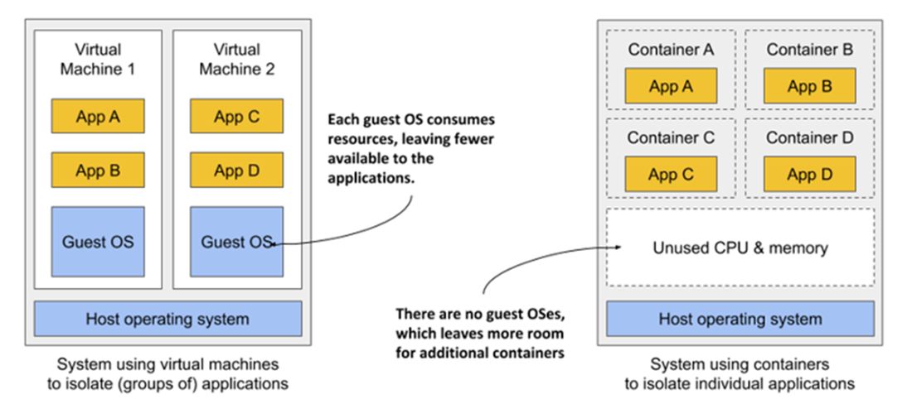
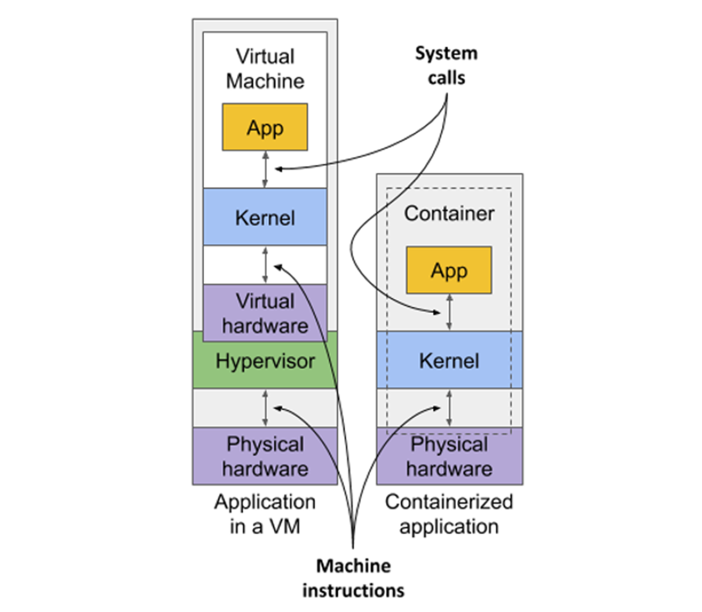
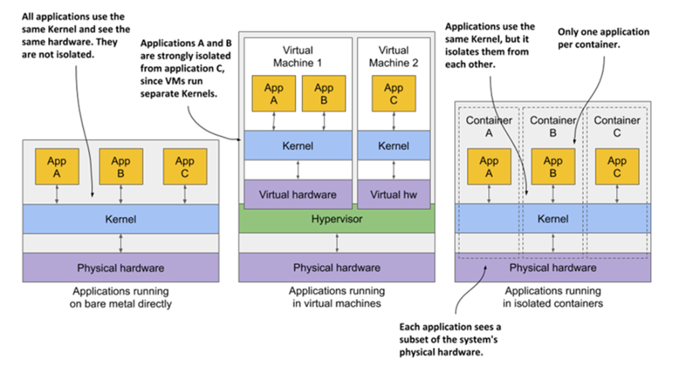
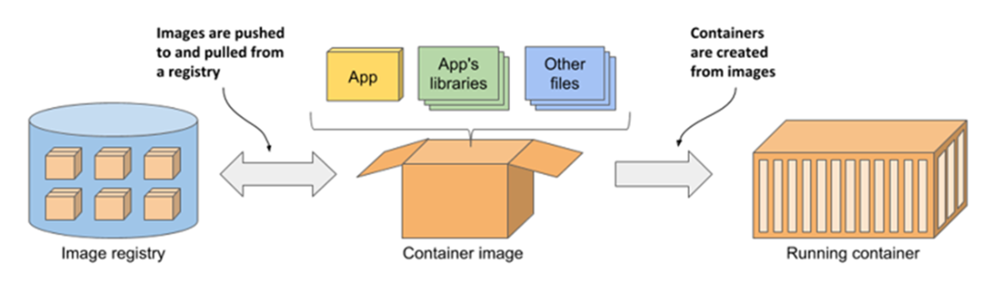
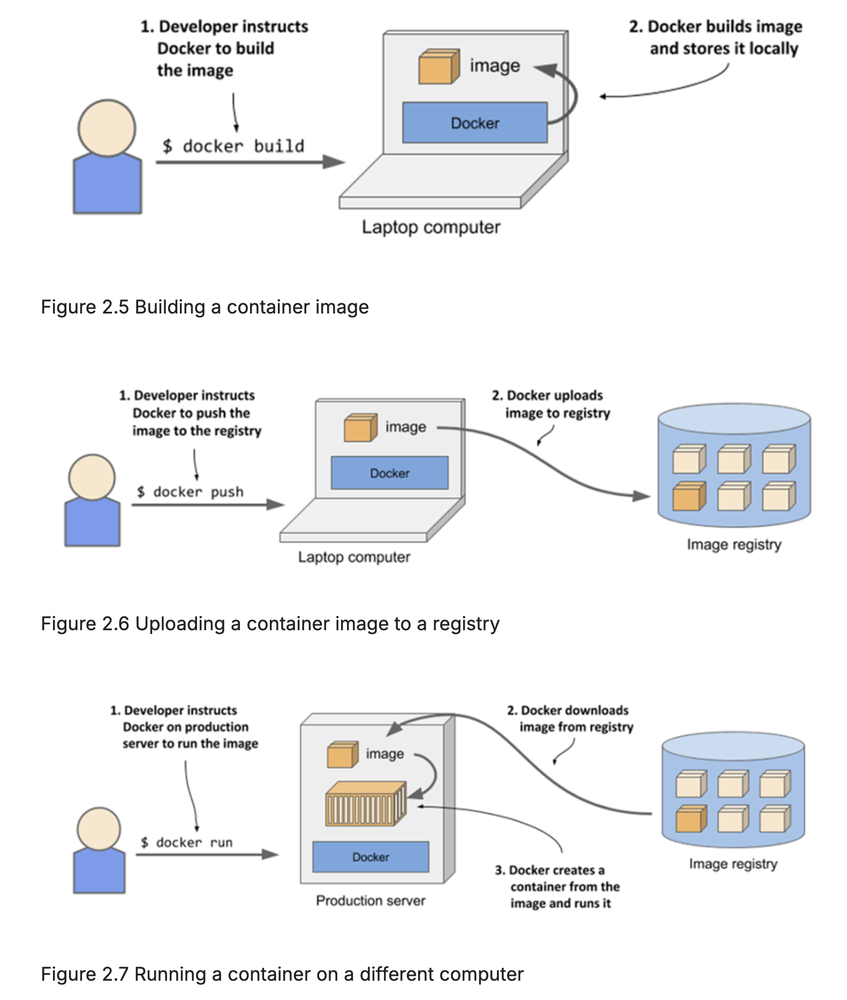

# Containers & Containerized Applications

Kubernetes primarily manages apps that run in containers. So let's first understand what containers are and how they work.

1. **Why Containers Are Needed?**

   * Microservices often require different, potentially conflicting dependencies.

   * So, assigning a separate VM per application works for small systems but becomes:
     * Expensive in hardware usage as they are resource-heavy due to OS duplication
     * Complex to manage and automate

   * The rise of microservices (with hundreds of instances) led to containers as a lighter alternative to VMs.

2. **Containers vs. Virtual Machines (Architecture Differences)**

    

    * Virtual Machines (VMs). Each VM runs – Its own operating system and kernel and runs multiple system processes

      * A hypervisor virtualizes hardware for each VM.
      * Applications make system calls to the guest OS kernel.
      * Strong isolation because each VM has its own kernel.

    * Containers – Run as processes inside the host operating system.
      * All containers share the same host kernel.
      * No hypervisor or CPU virtualization required.
      * Isolation is provided by the Linux kernel.
      * Each containerized process behaves as if it is the only process on the system.

3. **Overhead, Efficiency & Startup Times**

    

   * VMs have significant overhead, which includes:

     * Duplicate OS instances
     * Extra system processes
     * Higher CPU and memory usage

   * VMs take longer to start because – A full operating system must boot.

   * Containers have minimal overhead – Only the application process runs. No extra OS per container. This provides:

     * More efficient hardware utilization
     * Ability to run more applications on the same machine

   * Containers start faster because – Only the application process launches.

   * This makes containers better suited for scalable, dynamic systems.

4. **Isolation and Security Trade-offs**
    

   * VMs provide stronger isolation:
     * Each VM has its own kernel.
     * Faults or exploits are less likely to affect other VMs.

   * Containers share the host kernel:
     * Kernel vulnerabilities may impact multiple containers.
     * Isolation is strong but not as complete as VMs.

   * Although full isolation can only achieved with separate physical machines.

   * In contact to VMs which use separate memory allocations, Containers share the host memory space. Without memory limits:
     * One container can exhaust memory which could cause other containers to run out of memory or cause their data to be swapped out to disk.

5. **Container Technology**

   * While VMs rely on CPU virtualization support and hypervisor software on the host, containers are enabled by container technologies supported by the Linux kernel.

    * But instead of interacting with these technologies directly, you typically rely on tools such as Docker or Podman, which offer user-friendly interfaces for managing containers.

    * Kubernetes builds on these container technologies.

## Containers, Images & Registries

While container technologies have existed for a long time, they only became widely known with the rise of Docker.

Docker is a platform for packaging, distributing, and running applications. It allows you to package your app along with its entire environment. This can include only a few dynamically linked libraries required by the app or all the files that are usually shipped with an operating system.

Docker allows you to distribute this package via a public repository to any other Docker-enabled computer.

1. A **container image** is the packaged bundle that includes your application and its environment, similar to a zip file or tarball.

    * It consists of the entire filesystem needed by your application, and metadata, such as which executable file to run, the ports the application listens on, and other information about the image.

2. An **image registry** is a repository for storing and sharing container images b/w people and computers.

    * After you build an image, you either run it locally or upload(*push*) it to a registry, and then download(*pull*) it to another computer.
    
    * Just like GitHub repositories, image registries can be public or private.

3. A **container** is a running instance of an image and runs as a regular process on the host OS. However it's environment is isolated from the host OS and other running containers.

    * The container file system is derived from the container image. But additional filesystems can also be mounted into the container.
    
    * Containers are resource restricted, meaning they are allocated specific amounts of resources, such as CPU and memory, and can’t exceed these limits.