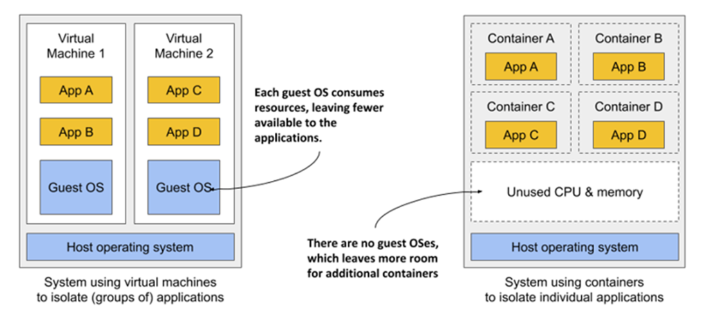
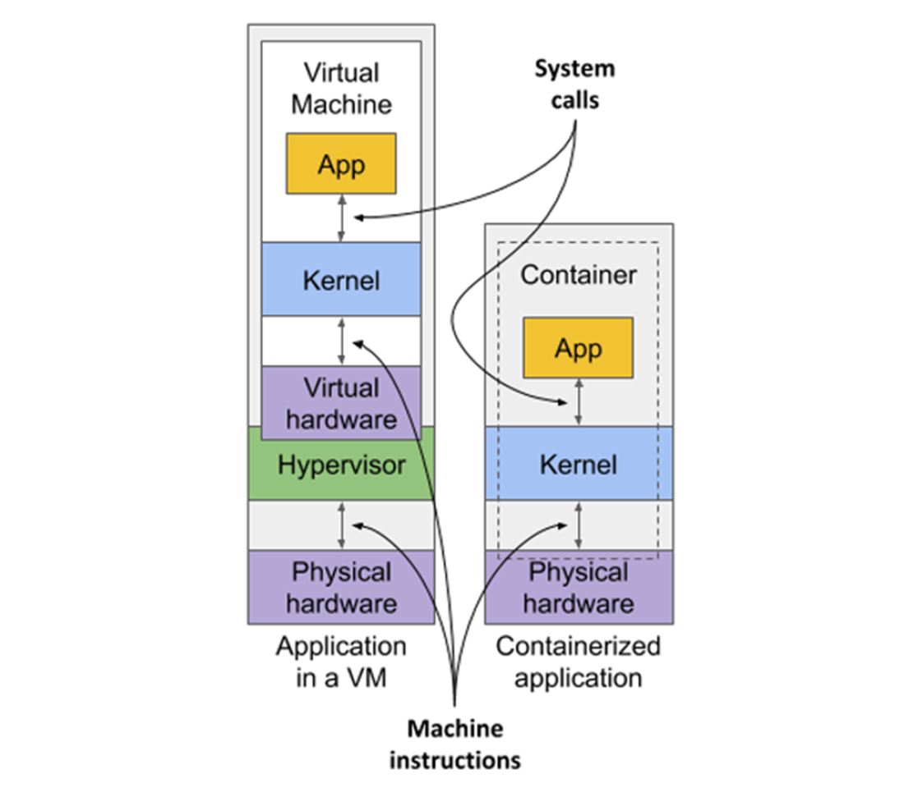
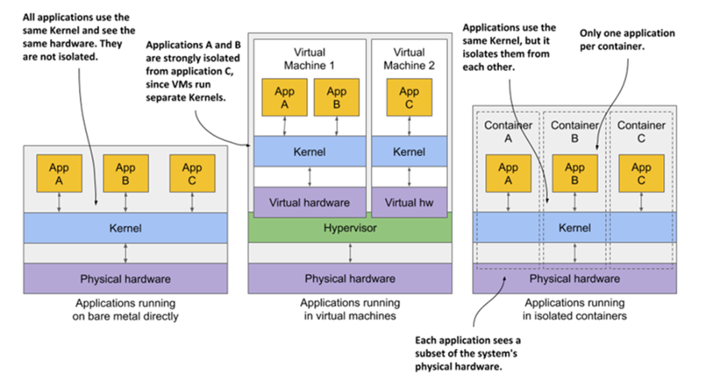
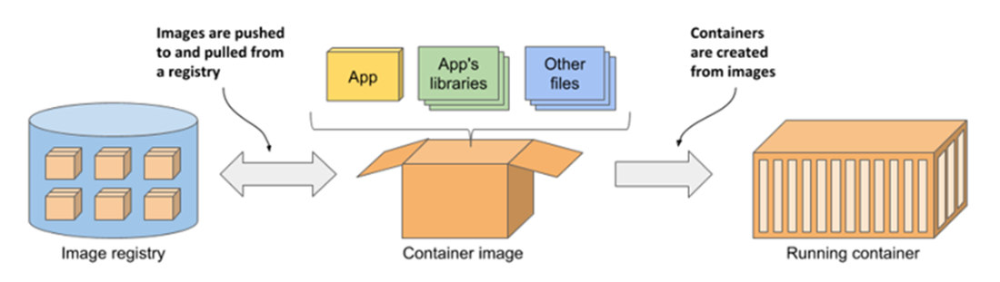
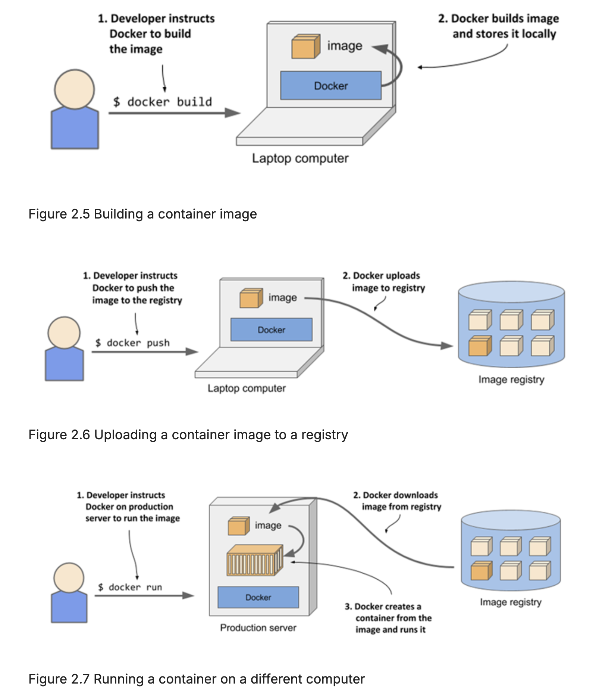
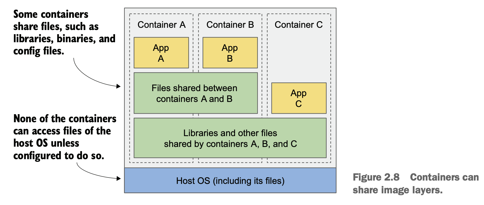
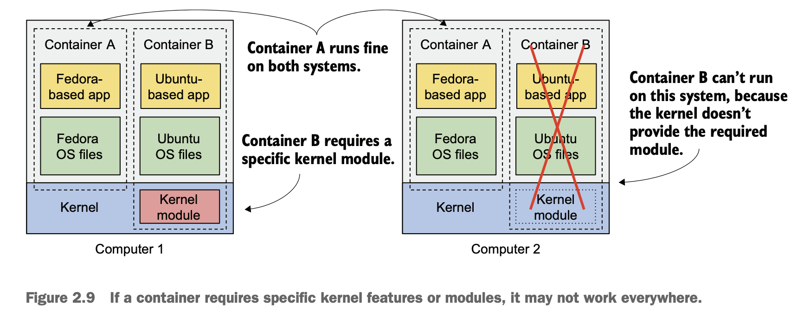
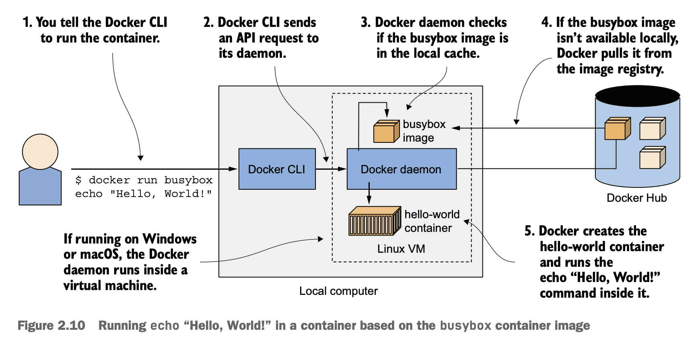

# Containers & Containerized Applications

Kubernetes primarily manages apps that run in containers. So let's first understand what containers are and how they work.

1. **Why Containers Are Needed?**

   * Microservices often require different, potentially conflicting dependencies.

   * So, assigning a separate VM per application works for small systems but becomes:
     * Expensive in hardware usage as they are resource-heavy due to OS duplication
     * Complex to manage and automate

   * The rise of microservices (with hundreds of instances) led to containers as a lighter alternative to VMs.


2. **Containers vs. Virtual Machines (Architecture Differences)**

    


    * Virtual Machines (VMs). Each VM runs – Its own operating system and kernel and runs multiple system processes

      * A hypervisor virtualizes hardware for each VM.
      * Applications make system calls to the guest OS kernel.
      * Strong isolation because each VM has its own kernel.


    * Containers – Run as processes inside the host operating system.
      * All containers share the same host kernel.
      * No hypervisor or CPU virtualization required.
      * Isolation is provided by the Linux kernel.
      * Each containerized process behaves as if it is the only process on the system.

3. **Overhead, Efficiency & Startup Times**

    

   * VMs have significant overhead, which includes:

     * Duplicate OS instances
     * Extra system processes
     * Higher CPU and memory usage

   * VMs take longer to start because – A full operating system must boot.

   * Containers have minimal overhead – Only the application process runs. No extra OS per container. This provides:

     * More efficient hardware utilization
     * Ability to run more applications on the same machine


   * Containers start faster because – Only the application process launches.

   * This makes containers better suited for scalable, dynamic systems.


4. **Isolation and Security Trade-offs**
    

   * VMs provide stronger isolation:
     * Each VM has its own kernel.
     * Faults or exploits are less likely to affect other VMs.

   * Containers share the host kernel:
     * Kernel vulnerabilities may impact multiple containers.
     * Isolation is strong but not as complete as VMs.

   * Although full isolation can only achieved with separate physical machines.

   * In contact to VMs which use separate memory allocations, Containers share the host memory space. Without memory limits:
     * One container can exhaust memory which could cause other containers to run out of memory or cause their data to be swapped out to disk.

5. **Container Technology**

   * While VMs rely on CPU virtualization support and hypervisor software on the host, containers are enabled by container technologies supported by the Linux kernel.

    * But instead of interacting with these technologies directly, you typically rely on tools such as Docker or Podman, which offer user-friendly interfaces for managing containers.

    * Kubernetes builds on these container technologies.


## Containers, Images & Registries



While container technologies have existed for a long time, they only became widely known with the rise of Docker.

Docker is a platform for packaging, distributing, and running applications. It allows you to package your app along with its entire environment. This can include only a few dynamically linked libraries required by the app or all the files that are usually shipped with an operating system.

Docker allows you to distribute this package via a public repository to any other Docker-enabled computer.




1. A **container image** is the packaged bundle that includes your application and its environment, similar to a zip file or tarball.

    * It consists of the entire filesystem needed by your application, and metadata, such as which executable file to run, the ports the application listens on, and other information about the image.

2. An **image registry** is a repository for storing and sharing container images b/w people and computers.

    * After you build an image, you either run it locally or upload(*push*) it to a registry, and then download(*pull*) it to another computer.
    
    * Just like GitHub repositories, image registries can be public or private.

3. A **container** is a running instance of an image and runs as a regular process on the host OS. However it's environment is isolated from the host OS and other running containers.

    * The container file system is derived from the container image. But additional filesystems can also be mounted into the container.
    
    * Containers are resource restricted, meaning they are allocated specific amounts of resources, such as CPU and memory, and can’t exceed these limits.


## Container Environment, Image Layers, Limitations



* File System:

  * The app running in a container only sees the files bundled in the container image and any additonal file system mounted into the container.

  * So it doesn't matter where it is running be it on your laptop or a production server with a completely different OS.

* Image Layers

  * Container images are made of thin layers that can be reused across other images given they use the same layer.
  
  * This makes image distribution very efficient as only the layers not present on the host system needs to be downloaded. Docker stores each layer once. This also helps with low storage footprint.

* How multiple containers sharing same file-system (i.e. container image layer) achieve isolation?

  *  The filesystems are isolated by the copy-on-write (CoW) mechanism.
  
  *  The filesystem of a container consists of read-only layers from the container image and an additional read/write layer stacked on top.
  
  *  When an application running in container A changes a file in one of the read-only layers, the entire file is copied into the container’s read/write layer, and the file contents are changed there.
  
  *  Since each container has its own writable layer, changes to shared files are not visible in any other container.
  
  *  When you delete a file, it is only marked as deleted in the read/write layer, but it’s still present in one or more of the layers below. However, this means that deleting files does not reduce the size of the image.

  > Even seemingly harmless operations, such as changing permissions or ownership of a file, result in a new copy of the entire file being created in the read/write layer. If you perform this type of operation on a large file or many files, the image size may swell significantly.

* Limitiations of Container Images

  

  * Since the linux kernel is not bundled with the container image. This means that it is upto the host where the container image is running to provided kernel-sepecific requirements for the image to run.
  
  * If a containerized application requires a particular kernel version, it may not work on every computer. If a computer is running a different version of the Linux kernel or doesn’t load the required kernel modules, the app can’t run on it.
  
  * Similarly, this extends to the hardware level as well. A containerized app built for specific hardware architecture can only run on computers with the same architecture.
  
  * An app compiled for x86 archictecture cannot run on an ARM-based computer. For this, either you would need a VM to emulate the specific architecture or use the image built for your specific machice type. This why images are built for specific hardware architecture and even specific OS.


## Understanding what happens when running a Container



```bash
docker run busybox echo "Hello World"
```

* When you execute the `docker run` command, the `docker` CLI tells the Docker Daemon(`dockerd`), which check if the image is present in its local cache.
* If not, it downloads it from DockerHub registry.
* Creates an container from the image and executes the `echo` command which then prints the text to `stdout`.
* Then the process terminates, and the container stops.

> A daemon process is process than runs in background (e.g. `dockerd`), listening to specific API requests (e.g. Docker CLI sending requests to it) to manage or handle specific tasks such as images, containers, networks, volumens. A daemon can also communicate with other daemons to manage other services provided by it.

> **If your local computer runs a Linux OS, the Docker CLI tool and the daemon both run in this OS. If it runs macOS or Windows, the daemon and the containers run in the Linux VM.**

## Image Tags

* Docker allows having multiple versions and variants of the same image under the same name. Each variant has a unique tag.
* If a image is specified without a specific tag, Docker assumes it to be the `latest` tag.
* When uploading a new version of an image, image authors usually tag it with both the actual version number and with latest.
* Even for a single version, there are several variants.

For example:

* there is `python:3.11`
* But then there is also `python:3.11-trixie` based on Debian 13 linux dist. (codenamed trixie)
* Similarly there is `bookworm`, `slim-bookworm` or `slim-trixie` based on the stripped down version of the linux distribution, making the image size relatively smaller.

## Open Container Initiative and Docker alternatives

* Docker was the first container platform to make containers mainstream.
* But this is to keep in mind, that docker itself is not what provides the process isolation.
* The actual isolation of containers take place at the Linux Kernel level using the mechanisms it provides.
* Docker is just a tool utilizing those mechanisms.

**Open Container Initiative (OCI):**

* After Docker's success, the OCI initiative was born to create open industry standards around container formats and runtime. Docker is a part of this.

* From there *OCI Image Format Specification* got created which prescribes a standard format for container imagess, and the *OCI Runtime Specification,* which defines standard interface for container runtimes to create, configure, and execute containers.

* Initially, K8s used Docker as container runtime, but now it supports other runtimes via *Container Runtime Inferface (CRI),* which defines a set of methods for creating, starting, stopping, and managing containers.

* One implementation of CRI is *CRI-O*, a lightweight container runtime optimized for Kubernetes, which allows it to run containers without using Docker. Another commonly used CRI implementation is *containerd*, a high-performance container runtime developed by Docker.
