# Containers & Containerized Applications

Kubernetes primarily manages apps that run in containers. So let's first understand what containers are and how they work.

1. **Why Containers Are Needed?**

   * Microservices often require different, potentially conflicting dependencies.

   * So, assigning a separate VM per application works for small systems but becomes:
     * Expensive in hardware usage as they are resource-heavy due to OS duplication
     * Complex to manage and automate

   * The rise of microservices (with hundreds of instances) led to containers as a lighter alternative to VMs.


2. **Containers vs. Virtual Machines (Architecture Differences)**

    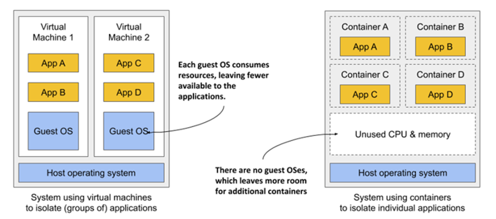


    * Virtual Machines (VMs). Each VM runs – Its own operating system and kernel and runs multiple system processes

      * A hypervisor virtualizes hardware for each VM.
      * Applications make system calls to the guest OS kernel.
      * Strong isolation because each VM has its own kernel.


    * Containers – Run as processes inside the host operating system.
      * All containers share the same host kernel.
      * No hypervisor or CPU virtualization required.
      * Isolation is provided by the Linux kernel.
      * Each containerized process behaves as if it is the only process on the system.

3. **Overhead, Efficiency & Startup Times**

    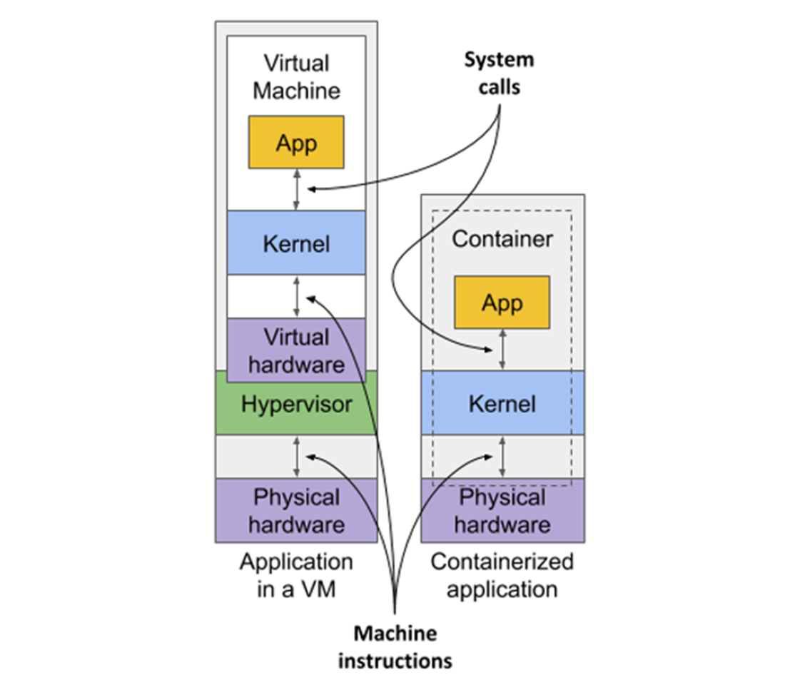

   * VMs have significant overhead, which includes:

     * Duplicate OS instances
     * Extra system processes
     * Higher CPU and memory usage

   * VMs take longer to start because – A full operating system must boot.

   * Containers have minimal overhead – Only the application process runs. No extra OS per container. This provides:

     * More efficient hardware utilization
     * Ability to run more applications on the same machine


   * Containers start faster because – Only the application process launches.

   * This makes containers better suited for scalable, dynamic systems.


4. **Isolation and Security Trade-offs**
    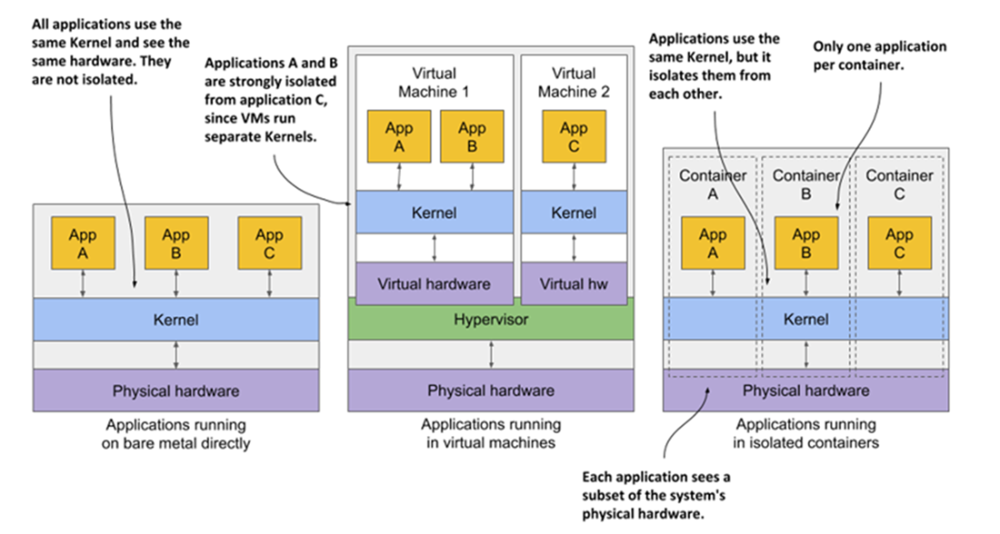

   * VMs provide stronger isolation:
     * Each VM has its own kernel.
     * Faults or exploits are less likely to affect other VMs.

   * Containers share the host kernel:
     * Kernel vulnerabilities may impact multiple containers.
     * Isolation is strong but not as complete as VMs.

   * Although full isolation can only achieved with separate physical machines.

   * In contact to VMs which use separate memory allocations, Containers share the host memory space. Without memory limits:
     * One container can exhaust memory which could cause other containers to run out of memory or cause their data to be swapped out to disk.

5. **Container Technology**

   * While VMs rely on CPU virtualization support and hypervisor software on the host, containers are enabled by container technologies supported by the Linux kernel.

    * But instead of interacting with these technologies directly, you typically rely on tools such as Docker or Podman, which offer user-friendly interfaces for managing containers.

    * Kubernetes builds on these container technologies.


## Containers, Images & Registries

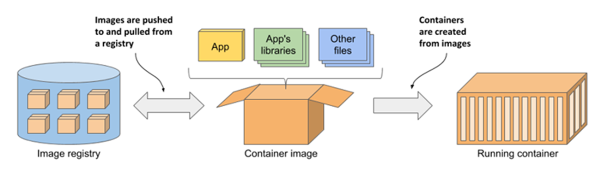

While container technologies have existed for a long time, they only became widely known with the rise of Docker.

Docker is a platform for packaging, distributing, and running applications. It allows you to package your app along with its entire environment. This can include only a few dynamically linked libraries required by the app or all the files that are usually shipped with an operating system.

Docker allows you to distribute this package via a public repository to any other Docker-enabled computer.


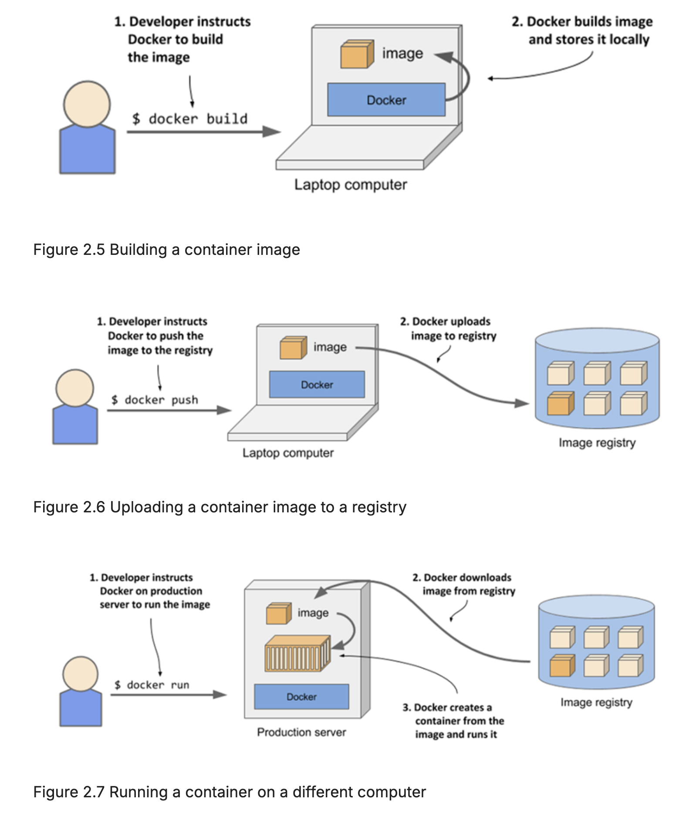

1. A **container image** is the packaged bundle that includes your application and its environment, similar to a zip file or tarball.

    * It consists of the entire filesystem needed by your application, and metadata, such as which executable file to run, the ports the application listens on, and other information about the image.

2. An **image registry** is a repository for storing and sharing container images b/w people and computers.

    * After you build an image, you either run it locally or upload(*push*) it to a registry, and then download(*pull*) it to another computer.
    
    * Just like GitHub repositories, image registries can be public or private.

3. A **container** is a running instance of an image and runs as a regular process on the host OS. However it's environment is isolated from the host OS and other running containers.

    * The container file system is derived from the container image. But additional filesystems can also be mounted into the container.
    
    * Containers are resource restricted, meaning they are allocated specific amounts of resources, such as CPU and memory, and can’t exceed these limits.


## Container Environment, Image Layers, Limitations

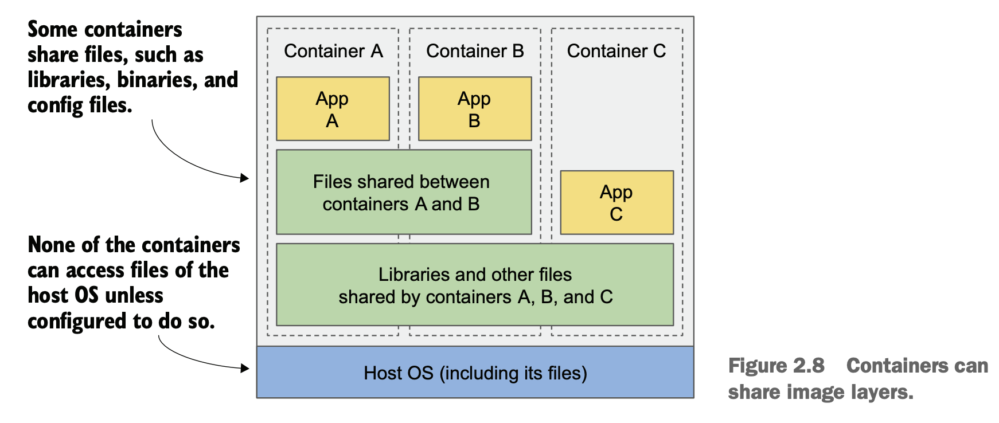

* File System:

  * The app running in a container only sees the files bundled in the container image and any additonal file system mounted into the container.

  * So it doesn't matter where it is running be it on your laptop or a production server with a completely different OS.

* Image Layers

  * Container images are made of thin layers that can be reused across other images given they use the same layer.
  
  * This makes image distribution very efficient as only the layers not present on the host system needs to be downloaded. Docker stores each layer once. This also helps with low storage footprint.

* How multiple containers sharing same file-system (i.e. container image layer) achieve isolation?

  *  The filesystems are isolated by the copy-on-write (CoW) mechanism.
  
  *  The filesystem of a container consists of read-only layers from the container image and an additional read/write layer stacked on top.
  
  *  When an application running in container A changes a file in one of the read-only layers, the entire file is copied into the container’s read/write layer, and the file contents are changed there.
  
  *  Since each container has its own writable layer, changes to shared files are not visible in any other container.
  
  *  When you delete a file, it is only marked as deleted in the read/write layer, but it’s still present in one or more of the layers below. However, this means that deleting files does not reduce the size of the image.

  > Even seemingly harmless operations, such as changing permissions or ownership of a file, result in a new copy of the entire file being created in the read/write layer. If you perform this type of operation on a large file or many files, the image size may swell significantly.

* Limitiations of Container Images

  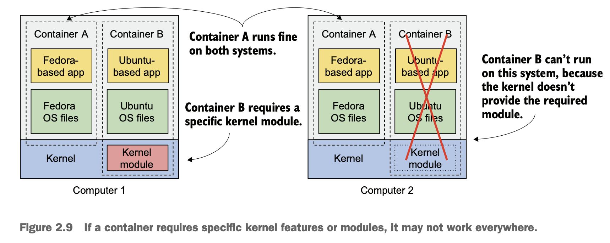

  * Since the linux kernel is not bundled with the container image. This means that it is upto the host where the container image is running to provided kernel-sepecific requirements for the image to run.
  
  * If a containerized application requires a particular kernel version, it may not work on every computer. If a computer is running a different version of the Linux kernel or doesn’t load the required kernel modules, the app can’t run on it.
  
  * Similarly, this extends to the hardware level as well. A containerized app built for specific hardware architecture can only run on computers with the same architecture.
  
  * An app compiled for x86 archictecture cannot run on an ARM-based computer. For this, either you would need a VM to emulate the specific architecture or use the image built for your specific machice type. This why images are built for specific hardware architecture and even specific OS.


## Understanding what happens when running a Container

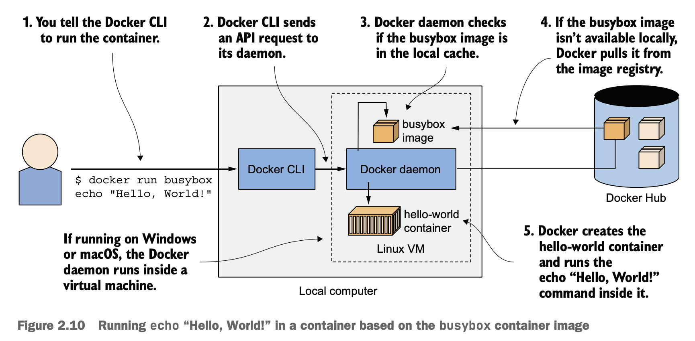

```bash
docker run busybox echo "Hello World"
```

* When you execute the `docker run` command, the `docker` CLI tells the Docker Daemon(`dockerd`), which check if the image is present in its local cache.
* If not, it downloads it from DockerHub registry.
* Creates an container from the image and executes the `echo` command which then prints the text to `stdout`.
* Then the process terminates, and the container stops.

> A daemon process is process than runs in background (e.g. `dockerd`), listening to specific API requests (e.g. Docker CLI sending requests to it) to manage or handle specific tasks such as images, containers, networks, volumens. A daemon can also communicate with other daemons to manage other services provided by it.

> **If your local computer runs a Linux OS, the Docker CLI tool and the daemon both run in this OS. If it runs macOS or Windows, the daemon and the containers run in the Linux VM.**

## Image Tags

* Docker allows having multiple versions and variants of the same image under the same name. Each variant has a unique tag.
* If a image is specified without a specific tag, Docker assumes it to be the `latest` tag.
* When uploading a new version of an image, image authors usually tag it with both the actual version number and with latest.
* Even for a single version, there are several variants.

For example:

* there is `python:3.11`
* But then there is also `python:3.11-trixie` based on Debian 13 linux dist. (codenamed trixie)
* Similarly there is `bookworm`, `slim-bookworm` or `slim-trixie` based on the stripped down version of the linux distribution, making the image size relatively smaller.

## Open Container Initiative and Docker alternatives

* Docker was the first container platform to make containers mainstream.
* But this is to keep in mind, that docker itself is not what provides the process isolation.
* The actual isolation of containers take place at the Linux Kernel level using the mechanisms it provides.
* Docker is just a tool utilizing those mechanisms.

**Open Container Initiative (OCI):**

* After Docker's success, the OCI initiative was born to create open industry standards around container formats and runtime. Docker is a part of this.

* From there *OCI Image Format Specification* got created which prescribes a standard format for container imagess, and the *OCI Runtime Specification,* which defines standard interface for container runtimes to create, configure, and execute containers.

* Initially, K8s used Docker as container runtime, but now it supports other runtimes via *Container Runtime Inferface (CRI),* which defines a set of methods for creating, starting, stopping, and managing containers.

* One implementation of CRI is *CRI-O*, a lightweight container runtime optimized for Kubernetes, which allows it to run containers without using Docker. Another commonly used CRI implementation is *containerd*, a high-performance container runtime developed by Docker.

* Thanks to the OCI and the CRI, the choice of container runtime in a Kubernetes cluster becomes irrelevant. You can build your container images with Docker and then run them in a cluster that employs any other OCI-compliant container runtime.

## Understanding How Docker Image is built

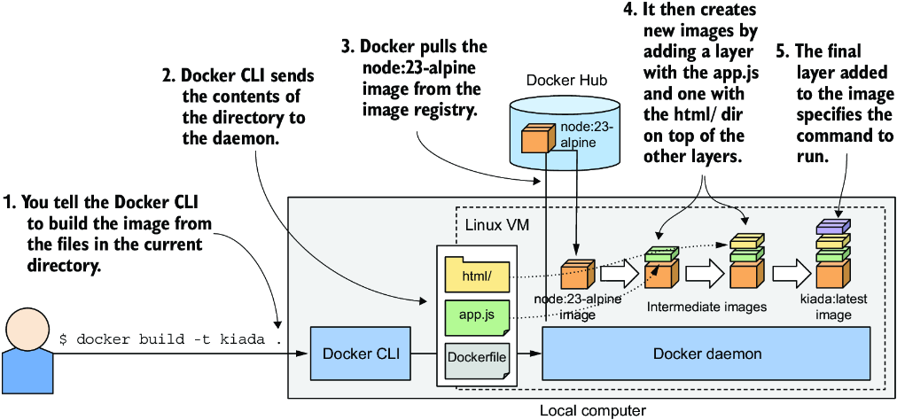


* The docker CLI doesn't builds the image, instead the entire contents of directory are uploaded to the Docker daemon and the image is built by it.

* The CLI (e.g.: Docker CLI) and the Daemon are two different things.
  * For non-Linux systems like macOS/Windows the daemon runs in a Linux VM.
  * And since image is built by the daemon, it can also also live on a seperate remote computer.
  > _Tip:_ And that is why you do not want to add unnecessary files to the build directory as they will slow down the build process, especially if the docker daemon lives on a remote machine.

* To build the image:

  ```Dockerfile
  # Use a base image as the starting point for the new image
  FROM python:3.11-slim-trixie

  # Set the working directory for the container
  WORKDIR /app

  # Copy the files needed for the image build process
  COPY pyproject.toml README.md uv.lock /app/

  # Run a command during the image build process, e.g.: install project dependencies
  RUN uv sync --locked

  # Copy the rest of the application code
  COPY . /app/

  # the default command to run when the container is started
  CMD ["uv", "run", "uvicorn", "main:app", "--host", "0.0.0.0", "--port", "8080", "--reload"]
  ```

  * Docker first pulls the base image from a public/private iamge repo. (unless already present locally)
  * Creates a new container from the image
  * And executes the commands in the Dockerfile in the order they are written.
  * The container's final state yields the image and is tagged with the tag provided in the `docker build` command.

* When building an image, a new image layer is created on top of the base image for each instruction (e.g.: `COPY`, `RUN`, `CMD`, `ENTRYPOINT`, etc.) in the Dockerfile.


  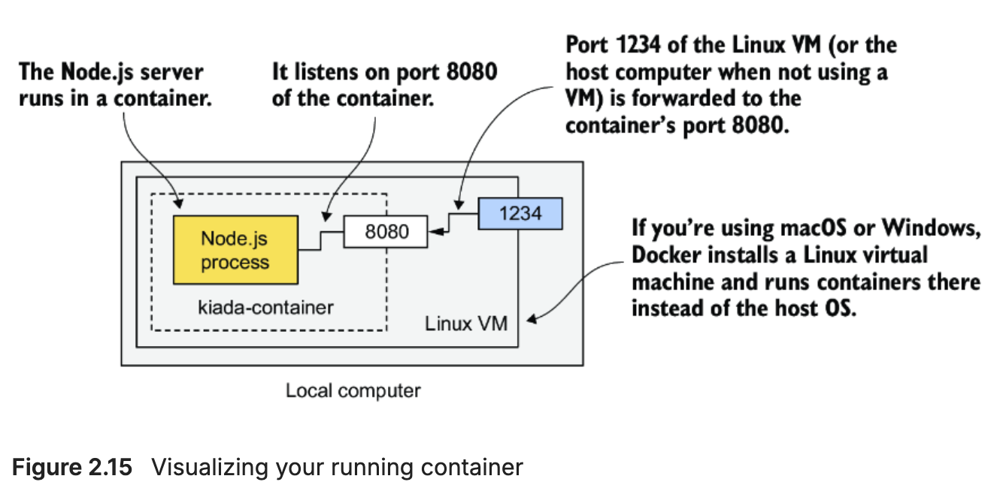


# Understanding Containers

Understading how containers enable process isolation without VMs using several features of Linux kernal.

## 1. Kernal Namespaces

* Linux/Kernal Namespaces is a feature that partitions kernal resources, providing process-level isolation so that a single process or a group of processes see distint, virtualized instances of global system resources.

* This means that process running in a container only sees some of the file system, process, network interfaces and even a different hostname on the system.

### Types of Namespaces:

There are several type of namespaces, one for each resource type. So a process not only uses a single namespace but a namespace for each type.

* The Mount namespace (`mnt`) isolates mount points (filesystems), allowing containers to have their own filesystem views.

* The Process ID namespace (`pid`) isolates process ID numbers, so processes can have the same PID across different namespaces.

* The Network namespace (`net`) isolates network devices, stacks, ip addresses, ports, routing tables, etc.

* The User ID namespace (`user`) isolates user and group IDs, allowing a user to have root privileges inside a container while being unprivileged outside.

* The Inter-process communication namespace (`ipc`) isolates the communication between processes (this includes isolating message queues, shared memory, and others).

* The UNIX Time-sharing System (`uts`) namespace isolates the system hostname and the Network Information Service (NIS) domain name.

* The Time namespace allows each container to have its own offset to the system clocks.

* The cgroup namespace isolates the Control Groups root directory.


### Network Namespaces

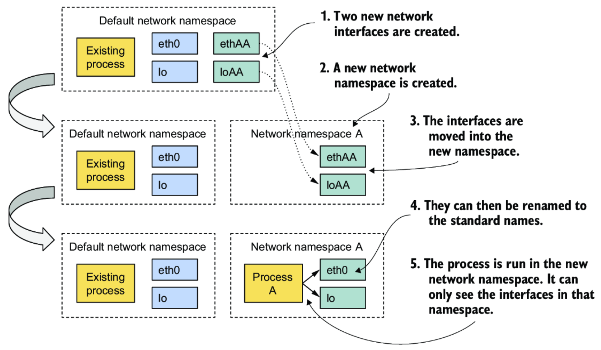

^^^This is how we give a container it's own network interface.

The network namespace limits the accessibility of network interfaces. By lokking solely at the available network interfaces, the process can't tell whether it is running in a container or a VM or an OS running directly on a bare-metal machine.

### UTS Namespace

UTS namespace gives a dedicated hostname to a process. It determines what hostname and domain name the process running inside this namespace sees.

Assigining 2 different uts namespaces to 2 different processes makes it look like as if they are running on two different computers.

### Understanding how namespaces isolate processes from each other

By creating dedicated namespaces for all available namespace types and assigning them to a process, it believes as it is running in its own OS.

The process can only see and use the resources in its own namespaces. It can’t use any resources in other namespaces.

This is how containers isolate the environments of the processes that run within them from those running in other containers.

### Sharing Namespaces b/w multiple processes

You do not always want to isolate the containers completely. (Why? covered in next chatper.) Related container may need to share certain resources.

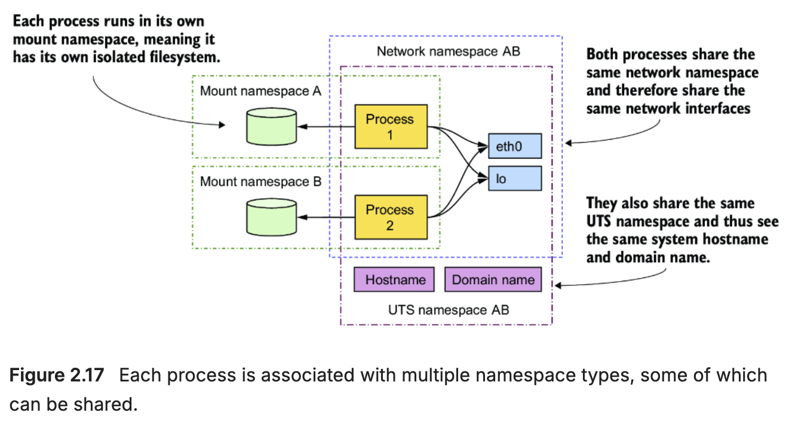

^^^Two processes sharing same network interfaces and the host & domain name, but they use separate filesystems.

Sharing the same network namespace allow them to bind to the same IP address and communicate through the _loopback address_, just as if they both were running on a machine and not in containers.

> A loopback address is a special IP address (commonly 127.0.0.1 in IPv4 or ::1 in IPv6, often called localhost) used by a computer to send network traffic to itself, bypassing physical hardware.

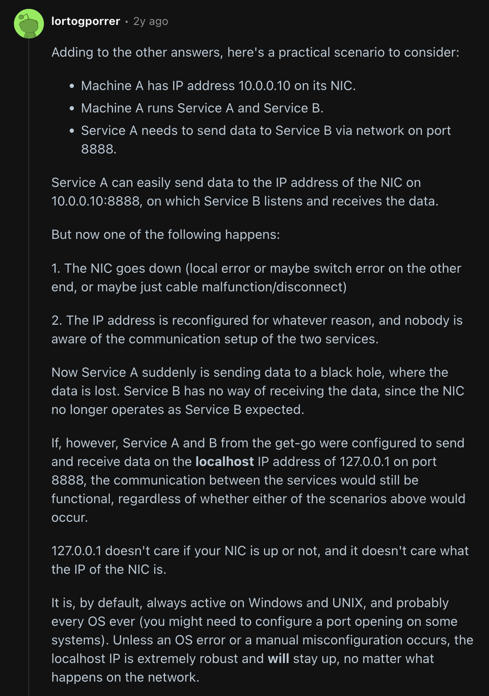

> ^^^[ref](https://www.reddit.com/r/networking/comments/1bgc63t/what_is_the_point_of_a_loopback_address/)


* In summary, processes may want to share some resources but not others. This is possible because of separate namespace types. A process has an associated namespace for each type.

* Because some resources are shared between multiple processes, this raises the question *what exactly is a container then?*
  
  * A process that runs "in a container" isn’t really enclosed in anything the way it is when running in a VM; it’s simply a process to which several namespaces are assigned (one namespace for each namespace type).
  
  * As some namespaces are shared with other processes, the boundaries between the processes do not always overlap.


## Exploring Container environment

To explore things like system hostname, local IP addresss, libraries installed in filesystem, and so on. In case of a VM, we connect to it remotely via ssh and use a shell to execute commands. With containers, we run a shell in the container.

```shell
docker exec -it kiada-container sh

# ls /
app  boot  etc   lib    mnt  proc  run   srv  tmp  var
bin  dev   home  media  opt  root  sbin  sys  usr

# whoami
root

## install ps command if not available: ``apt-get update && apt-get install -y procps``
## list the processes running inside the container
# ps aux
USER         PID %CPU %MEM    VSZ   RSS TTY      STAT START   TIME COMMAND
root           1  0.0  1.4 199664 121072 ?       Ssl  02:46   0:00 uv run uvicorn main:app --host 0.0.0.0 --port 8080 -
root          41  7.2  0.3  39940 28732 ?        S    02:46   2:01 /app/.venv/bin/python /app/.venv/bin/uvicorn main:ap
root          42  0.0  0.1  16116 11828 ?        S    02:46   0:00 /app/.venv/bin/python -c from multiprocessing.resour
root          43  0.2  0.5  60160 47884 ?        S    02:46   0:04 /app/.venv/bin/python -c from multiprocessing.spawn 
root          44  0.0  0.0   2408  1444 pts/0    Ss   02:47   0:00 sh
root          86  0.0  0.0      0     0 pts/0    Z    02:50   0:00 [dpkg-preconfigu] <defunct>
root         155  0.0  0.0   6404  3464 pts/0    R+   03:14   0:00 ps aux
```

The command runs `sh` as an additional processs in the existing `kiada-container`. The process has the same Linux namespaces as the main container process (the running uvicorn server). This way you can explore the container from within and see how uvicorn and your app see the system when running in the container.

The `-it` option is a shorthand for two options:

* `-i` tells docker to run the command in interactive mode
* `-t` tells it to allocate a pseudo terminal (TTY) so we can use the shell properly

You need both if you want to use the shell the way you’re accustomed to. If you omit the first, you can’t execute any commands, and if you omit the second, the command prompt doesn’t appear, and some commands may complain that the TERM variable is not set.


### Seeing Container process in the Host's list of processes

Since on non-Linux environment (Win/macOS) the docker daemon runs in a VM, to see the container process running as host, we will have to look inside the VM

```shell
╭─amit@mac ~/repos/me/k8s-in-action ‹main●› 
╰─$ docker run --net=host --ipc=host --uts=host --pid=host -it --security-opt=seccomp=unconfined --privileged --rm -v /:/host alpine chroot /host
root@docker-desktop:/# 


root@docker-desktop:/# ps aux | grep "uv run uvicorn main:app --host" | grep -v grep
USER         PID %CPU %MEM    VSZ   RSS TTY      STAT START   TIME COMMAND
root        3974  0.0  1.4 199664 121072 ?       Ssl  02:46   0:00 uv run uvicorn main:app --host 0.0.0.0 --port 8080 --reload
```

If you notice, the process ID(PID) for the uvicorn server differ from that of inside the container. Inside the container the PID is 1 but on the host (i.e. VM here) it is 3974.

The difference exists because the container operates within its own Process ID namespace, maintaining its own independent process tree and its own sequence of IDs.

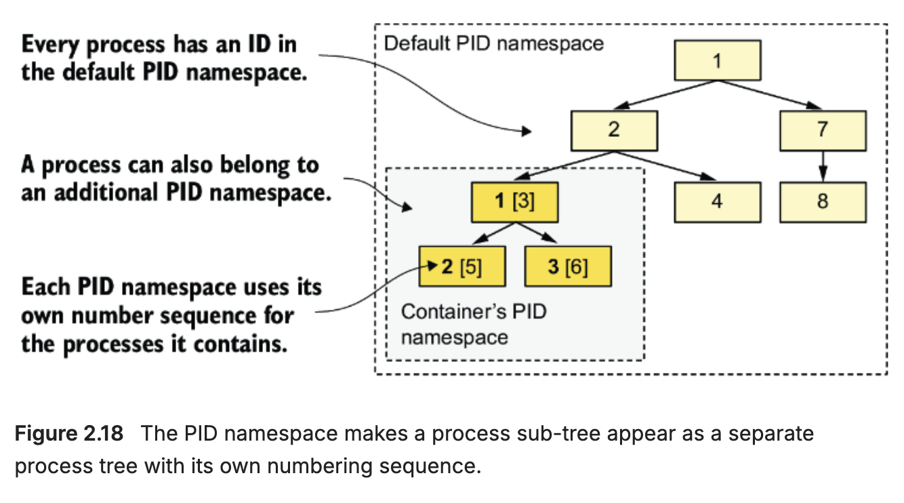

The above figure shows the tree is a subtree of the host's full process tree. Each process thus has two IDs.

### Understanding Container Filesystem Isolation

As an isolated process tree, each container also has an isolated filesystem. Inspecting the container's root dir will list all the included files from the container base image, `python:3.12-slim-trixie`, and the files we include while building the kiada container in the `/app` dir.


```shell
## Inspecting the root directory filesystem
# ls -lha /
total 84K
drwxr-xr-x   1 root root 4.0K May  2 02:46 .
drwxr-xr-x   1 root root 4.0K May  2 02:46 ..
-rwxr-xr-x   1 root root    0 May  2 02:46 .dockerenv
drwxr-xr-x   1 root root 4.0K May  2 02:46 app
lrwxrwxrwx   1 root root    7 Mar  2 21:50 bin -> usr/bin
drwxr-xr-x   2 root root 4.0K Mar  2 21:50 boot
drwxr-xr-x   5 root root  340 May  2 02:46 dev
drwxr-xr-x   1 root root 4.0K May  2 02:50 etc
drwxr-xr-x   2 root root 4.0K Mar  2 21:50 home
lrwxrwxrwx   1 root root    7 Mar  2 21:50 lib -> usr/lib
drwxr-xr-x   2 root root 4.0K Apr 21 00:00 media
drwxr-xr-x   2 root root 4.0K Apr 21 00:00 mnt
drwxr-xr-x   2 root root 4.0K Apr 21 00:00 opt
dr-xr-xr-x 277 root root    0 May  2 02:46 proc
drwx------   1 root root 4.0K May  2 02:46 root
drwxr-xr-x   3 root root 4.0K Apr 21 00:00 run
lrwxrwxrwx   1 root root    8 Mar  2 21:50 sbin -> usr/sbin
drwxr-xr-x   2 root root 4.0K Apr 21 00:00 srv
dr-xr-xr-x  11 root root    0 May  2 02:48 sys
drwxrwxrwt   1 root root 4.0K May  2 02:50 tmp
drwxr-xr-x   1 root root 4.0K Apr 21 00:00 usr
drwxr-xr-x   1 root root 4.0K Apr 21 00:00 var

## Inspecting the app directory
# ls -lha /app
total 104K
drwxr-xr-x 1 root root 4.0K May  2 02:46 .
drwxr-xr-x 1 root root 4.0K May  2 02:46 ..
-rw-r--r-- 1 root root    5 Mar 23 07:39 .python-version
drwxr-xr-x 1 root root 4.0K May  2 02:46 .venv
-rw-r--r-- 1 root root  302 Mar 24 02:59 README.md
drwxr-xr-x 2 root root 4.0K May  2 02:46 __pycache__
-rw-r--r-- 1 root root  325 May  2 02:46 docker-compose.yaml
-rw-r--r-- 1 root root 4.1K Apr 26 07:20 main.py
-rw-r--r-- 1 root root  244 Mar 24 03:16 pyproject.toml
-rwxr--r-- 1 root root 1.5K Apr 26 04:01 run
drwxr-xr-x 5 root root  160 Mar 23 08:17 static
drwxr-xr-x 5 root root  160 Apr 26 03:50 templates
-rw-r--r-- 1 root root  49K Mar 24 03:16 uv.lock
```

If you look at how the Dockerimage is defined, you can see the `uv` and `uvx` installed in the `/bin` dir and all the app files in the `/app` dir.

## Cgroups

* **Linux namespaces make it so that a process only access some of the host's resources, but they do not limit how much of a single resource each process can consume.**

* For example: you can use namespaces to allow a process to access only a particular network interface, but you can’t limit the network bandwidth the process consumes.

  * Likewise, you can’t use namespaces to limit the CPU time or memory available to a process. But you may need to do this to prevent one process from consuming all the CPU time and preventing critical system processes from running properly.

* For that, we need another feature of the Linux kernel called *Linux Control Groups (cgroups)*. The second Linux kernal feature that makes container possible.

* It limits, accounts for, and isolates system resources such as CPU, memory, as well as disk and network bandwidth. When using cgroups, a process or group of processes can only use the allotted CPU time, memory, and network bandwidth. This way, processes cannot consume resources reserved for others.

> [How cgroups work?](https://docs.redhat.com/en/documentation/red_hat_enterprise_linux/6/html/resource_management_guide/ch01)

At this point, you don’t need to know how Control Groups do all this, but it may be worth seeing how you can ask Docker to limit the amount of CPU and memory a container can use.


```shell
# docker stats kiada-container, shows the live view of how much system resources your container is using
# the --no-stream flag shows a snapshot
$ docker stats kiada-container --no-stream
CONTAINER ID   NAME              CPU %     MEM USAGE / LIMIT    MEM %     NET I/O          BLOCK I/O         PIDS
879619eeb487   kiada-container   9.09%     189.1MiB / 7.75GiB   2.38%     11.3MB / 174kB   26.6MB / 39.2MB   6
```


* **Limiting CPU Usage**
  
  * Not restricting container's use of the CPU, gives it unrestricted access to all CPU cores on the host.
  * You can explicitly specify which cores a container can use with Docker’s `--cpuset-cpus` option.
    ```shell
    # Only use cores one and two
    docker run --cpuset-cpus="1,2" ...

    # Only use half a core
    docker run --cpus="0.5"
    ```
  * You can also limit the available CPU time using options `--cpus`, `--cpu-period`, `--cpu-quota`, and `--cpu-shares`.


* **Limiting Memory Usage**
  
  * Docker provides the following options to limit container memory and swap usage: `--memory`, `--memory-reservation`, `--kernel-memory`, `--memory-swap`, and `--memory-swappiness`.

    ```shell
    # m stands for megabyte
    docker run --memory="100m"
    ```
  

**Behind the scenes, all these Docker options merely configure the cgroups of the process. It’s the Kernel that enforces these limits.**

## Strengthening isolation between containers – Privileges

Linux namespaces and cgroups separate the containers’ environments and prevent one container from starving the other containers of compute resources. But **the processes in these containers use the same system kernel, so we can’t say that they are fully isolated.** A rogue container could make malicious system calls that would affect its neighbors.

Imagine a Kubernetes node on which several containers run. Each container has its own network devices and files and can only consume a limited amount of CPU and memory. At first glance, a rogue program in one of these containers can’t cause damage to the other containers. But what if the rogue program modifies the system clock shared by all containers?

Depending on the application, changing the time may not be too much of a problem, but **allowing programs to make any system call to the kernel allows them to do virtually anything. Syscalls allow them to modify the kernel memory, add or remove kernel modules, and many other things that containers aren’t supposed to do.**

This brings us to the third set of technologies that make containers possible.

### Giving Containers Full Privileges to the System

The operating system kernel provides a set of syscalls that programs use to interact with the operating system and underlying hardware. These include calls to create processes, manipulate files and devices, establish communication channels between applications, and others.

Some of these syscalls are safe and available to any process, but others are reserved for processes with elevated privileges only.

If you look at the example presented earlier, applications running on the Kubernetes node should be allowed to open their local files, but not change the system clock or modify the kernel in a way that breaks the other containers.

Most containers should therefore run without elevated privileges to enhance security. However, if an application requires elevated privileges and you trust its provider, it can be run in a privileged container.

But keep in mind that processes in privileged containers are not restricted and can execute any system call. Therefore, running a privileged container should be approached with caution and only when absolutely necessary.

> With Docker, create a privileged container by using the `--privileged` flag.

### Using CAPABILITIES to give Containers a subset of all Privileges

* If an application only requires a subset of syscalls that need elevated privileges, creating a fully privileged container is not ideal. Fortunately, the Linux kernel breaks privileges into units called capabilities.

* Some examples of these capabilities include

  * `CAP_NET_ADMIN` — Allows the process to perform network-related operations
  * `CAP_NET_BIND_SERVICE` — Allows it to bind to port numbers less than 1024
  * `CAP_SYS_TIME` — Allows it to modify the system clock, and so on

* Capabilities can be added or removed (dropped) from a container when you create it. Each capability represents a set of privileges available to the processes in the container.

* Docker and Kubernetes drop all capabilities except those required by typical applications, but users can add or drop other capabilities.

> Always follow the *principle of least privilege* to avoid exposing security vulnerabilities.

### Using `seccomp` profiles to filter individual syscalls

If you need fine-grained control over what syscalls a program can make, you can use `seccomp` (Secure Computing Mode).

You can create a custom `seccomp` profile by creating a JSON file that lists the syscalls the container is allowed to make. You then provide the file to Docker when you create the container.

### Hardening containers using AppArmor and SELinux

Containers can also be secured by using two additional mandatory access control (MAC) mechanisms: SELinux (Security-Enhanced Linux) and AppArmor (Application Armor).

With SELinux, you attach labels to files and system resources, as well as to users and processes. A user or process can only access a file or resource if the labels of all subjects and objects involved match a set of policies.

AppArmor is similar but uses file paths instead of labels and focuses on processes rather than users. Both SELinux and AppArmor considerably improve the security of an operating system.
