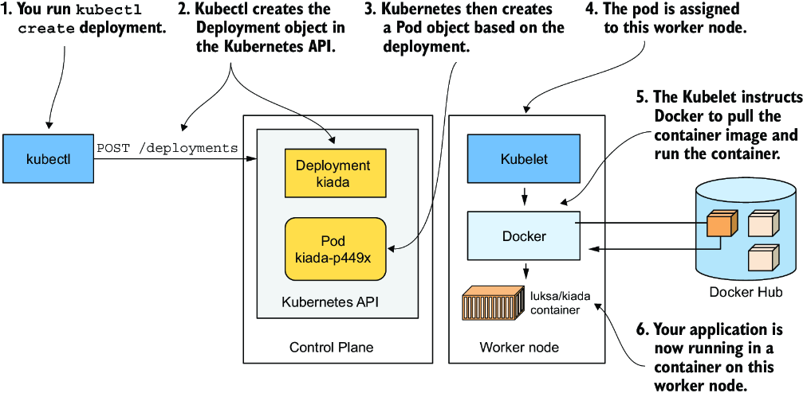
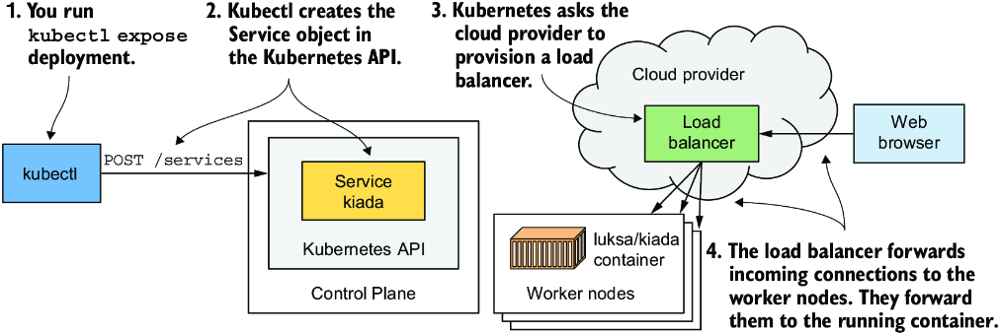
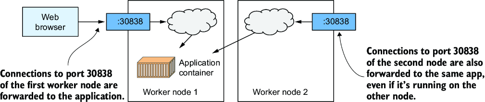
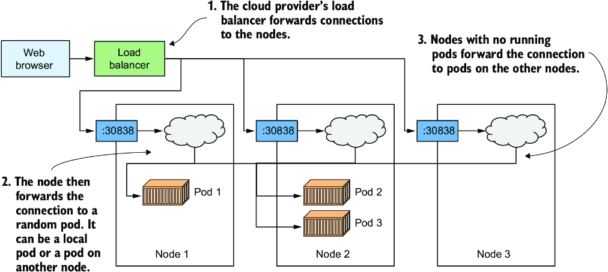

# Deploying a Kubernetes Cluster

## Running a Cluster locally

### Kubernetes in Docker Desktop

Docker desktop by default provides a single node Kubernetes Cluster.


* Docker Desktop sets up a Linux VM that hosts the Docker Daemon and all the containers.
* This VM also runs the Kubelet—the Kubernetes agent that manages the node.
* The components of the control plane run in containers, as do all the applications you deploy.

At the time of writing, Docker Desktop provides no command to log into the VM if you want to explore it from the inside. However, you can run a special container configured to use the VM’s namespaces to run a remote shell, which is virtually identical to using SSH to access a remote server.

```shell
docker run --net=host --ipc=host --uts=host --pid=host --privileged \
  --security-opt=seccomp=unconfined -it --rm -v /:/host alpine chroot /host
```

* The container is created from the `alpine` image.

* The `--net`, `--ipc`, `--uts`, and `--pid` flags make the container use the host’s namespaces instead of being sandboxed, and the `--privileged` and `--security-opt` flags give the container unrestricted access to all sys-calls.

* The `-it` flag runs the container interactive mode, and the `--rm` flags ensures the container is deleted when it terminates.

* The `-v` flag mounts the host’s root directory to the `/host` directory in the container. The `chroot /host` command then makes this directory the root directory in the container.

After you run the command, you are in a shell that’s effectively the same as if you had used SSH to enter the VM. Use this shell to explore the VM—try listing processes by executing the `ps aux` command or explore the network interfaces by running `ip addr`.


### Minikube

Minikube is another tool to locally run a kubernetes cluster.


```shell
curl -LO https://github.com/kubernetes/minikube/releases/latest/download/minikube-darwin-arm64 && sudo install minikube-darwin-arm64 /usr/local/bin/minikube

# start a single node cluster
minikube start

# If you use Linux, you can reduce the resource footprint of Minikube by creating the cluster without a VM.
minikube start --vm-driver none

# check status
minikube status

# to log into the Minikube VM
minikube ssh
```

The architecture of the system is practically identical to how Docker Desktop runs a clutser. The control plane components run in containers in the VM or directly in your host OS (in case of Linux) if you used the `--vm-driver none` option to create the cluster. The Kubelet runs directly in the VM’s or your host’s operating system. It runs the applications you deploy in the cluster via the Docker Daemon.

### Using kind (Kubernetes in Docker)


* Instead of running Kubernetes in a VM or directly on host OS, kind runs each K8s cluster node inside a container.

* This feature allows it to easily create multi-node cluster by starting several container.

* And the application we deploy run inside these node containers.

* Running kubernetes using kind means that all K8s componentes run in the host OS as well as the applications we deploy to the cluster also run in the host OS. (in case on non-Linux machines in the VM running docker daemon)

* This makes kind the perfect tool for development and testing, as everything runs locally, and you can debug running processes as easily as when you run them outside of a container. 

```shell
# start single node cluster
kind create cluster

# create multi-node cluster
cat <<-EOF | kind create cluster --config -
kind: Cluster
apiVersion: kind.x-k8s.io/v1alpha4
nodes:
    - role: control-plane
    - role: worker
    - role: worker
EOF

# `--config -` tells kind to read config from stdin
# <<-EOF preserves the leading tab spaces

# List worker nodes
$ kind get nodes
kind-worker2
kind-control-plane
kind-worker

# list all node using kubectl
$ kubectl get nodes -A --context kind-kind      
NAME                 STATUS   ROLES           AGE   VERSION
kind-control-plane   Ready    control-plane   40s   v1.35.0
kind-worker          Ready    <none>          26s   v1.35.0
kind-worker2         Ready    <none>          26s   v1.35.0

# Since each node runs as a container, you can also see the nodes by listing the running containers using:
$ docker ps                                                            
CONTAINER ID   IMAGE                  COMMAND                  CREATED          STATUS          PORTS                       NAMES
e4dbf9a7e195   kindest/node:v1.35.0   "/usr/local/bin/entr…"   59 seconds ago   Up 56 seconds                               kind-worker2
d0ec3c431c1a   kindest/node:v1.35.0   "/usr/local/bin/entr…"   59 seconds ago   Up 56 seconds   127.0.0.1:50692->6443/tcp   kind-control-plane
2470f4bc33e6   kindest/node:v1.35.0   "/usr/local/bin/entr…"   59 seconds ago   Up 56 seconds                               kind-worker

# delete a cluster
kind delete cluster --name <defaults to kind>
```

Unlike Minikube, where you use `minikube ssh` to log into the node if you want to explore the processes running inside of it, with kind, you use `docker exec`.

E.g: to enter the node called kind-control-plane, run

```shell
docker exec -it kind-control-plane bash
```

Instead of using Docker to run containers, nodes created by kind use the CRI-O container runtime as a lightweight alternative to Docker.

The crictl CLI tool is used to interact with CRI-O. Its use is very similar to that of the docker tool.

After logging into the node, list the containers running in it by using `crictl ps` instead of docker ps. Here’s an example of the command and its output:

```shell    
root@kind-control-plane:/# crictl ps
CONTAINER           IMAGE               CREATED             STATE               NAME                      ATTEMPT             POD ID              POD                                          NAMESPACE
ccf2b7e936606       909b40d32940f       2 minutes ago       Running             local-path-provisioner    0                   d82928158bd0c       local-path-provisioner-67b8995b4b-lnrqg      local-path-storage
d5ce443ec3353       e08f4d9d2e6ed       2 minutes ago       Running             coredns                   0                   a9b7859fc3b6d       coredns-7d764666f9-mlnjx                     kube-system
c5a86d6074da7       e08f4d9d2e6ed       2 minutes ago       Running             coredns                   0                   209b090f13478       coredns-7d764666f9-2xldb                     kube-system
e82dc373af069       c96ee3c174987       2 minutes ago       Running             kindnet-cni               0                   cbde80ae133a8       kindnet-ptfxb                                kube-system
16302fcb47701       de369f46c2ff5       2 minutes ago       Running             kube-proxy                0                   f1eb87f53cd4b       kube-proxy-54chl                             kube-system
f4da7bdd4a750       271e49a0ebc56       3 minutes ago       Running             etcd                      0                   c4ae7e452a726       etcd-kind-control-plane                      kube-system
dddd45682e397       c3fcf259c473a       3 minutes ago       Running             kube-apiserver            0                   d3b4977042e72       kube-apiserver-kind-control-plane            kube-system
07c7bf34574ef       88898f1d1a62a       3 minutes ago       Running             kube-controller-manager   0                   cfc4f3d37e024       kube-controller-manager-kind-control-plane   kube-system
f0f994206ebff       ddc8422d4d35a       3 minutes ago       Running             kube-scheduler            0                   66d0f7fd74f10       kube-scheduler-kind-control-plane            kube-system
```

## Interacting with Kubernetes

kubectl communicates with the Kubernetes API server, which is part of the Kubernetes Control Plane. The control plane then triggers the other components to do whatever needs to be done based on the changes you made via the API.


kubectl loads it configuration from a config file called _kubeconfig_.


# Deploying an Application in a Cluster

## Running your first application

Two ways to deploy:

* **Declarative** — write YAML/JSON that describes the desired objects, then `kubectl apply`.
* **Imperative** — create objects with one-line commands like `kubectl create deployment` (easier when learning).

### Deployments

A **Deployment** is the object that represents an application running in the cluster. Creating one tells Kubernetes: “keep this many replicas of this container image running.”

```shell
$ kubectl create deployment kiada --image=kiada:latest
deployment.apps/kiada created
```

You specify:

1. Object type: Deployment
2. Name: `kiada`
3. Container image: `kiada:latest` (either from local docker daemon or pulled from Docker Hub by default)

This stores the object in the Kubernetes API — your **desired state**. Kubernetes then works to make the **actual state** match it.

```shell
$ kubectl get deployments
NAME    READY   UP-TO-DATE   AVAILABLE   AGE
kiada   0/1     1            0           6s
```

* `UP-TO-DATE` — how many replicas match the desired pod template
* `READY` / `AVAILABLE` — how many are actually ready to serve traffic

### Pods (not containers)

```shell
$ kubectl get containers
error: the server doesn't have a resource type "containers"
```

Containers are **not** a top-level Kubernetes object. The smallest deployable unit is a **pod**.

A **pod** is a group of one or more co-located containers that:

* Run on the **same worker node**
* Share Linux namespaces (network, UTS, and others depending on the pod spec)
* Share one IP, hostname, and port space — like a small logical computer for one application


Pods are scheduled across worker nodes. Containers in the same pod see each other as if alone on a machine; they don’t see processes from other pods, even on the same node.

### Listing and inspecting pods

Creating a Deployment creates one or more pods under it:

```shell
$ kubectl get pods
NAME                     READY     STATUS    RESTARTS   AGE
kiada-9d785b578-p449x    0/1       Pending   0          1m
```

Typical lifecycle:

1. **Pending** — scheduled (or waiting to be); node may still be pulling the image
2. **Running** — container created and started

If the image can’t be pulled (private registry, wrong name, etc.), `STATUS` shows the failure. Use `kubectl describe pod <name>` and check the **Events** section for scheduling, pull, create, and start details.

```shell
$ kubectl describe pod kiada-9d785b578-p449x
# ... look at Events at the bottom:
# Scheduled → Pulling → Pulled → Created → Started
```

## Understanding how a deployment is created



1. `kubectl create` command sends an HTTP request to the Kubernetes API Server.
2. Kubernetes then creates a new Pod object, which is then assigned or _scheduled_ on one of the worker nodes.
3. Kubernetes Agent (the Kubelet) on the worker node see the newly created Pod object, sees that it is scheduled on its node, instructs Docker to pull the specific image from the registry, creates a container from the image and executes it.

> The term _scheduling_ refers to the assignment of the pod to a node. The pod runs immediately, not at some point in the future. Just like how the CPU scheduler in an operating system selects what CPU to run a process on, the scheduler in Kubernetes decides what worker node should execute each container. Unlike an OS process, once a pod is assigned to a node, it runs only on that node. Even if it fails, this instance of the pod is never moved to other nodes, as is the case with CPU processes, but a new pod instance may be created to replace it.

In an multi-node setup none of the other worker nodes are involved the process.


## Service: Exposing application to the world

Pods get an IP, but that IP is **internal to the cluster**. To reach the app from outside, create a **Service**.

Service types differ by who can reach them:

* some only expose pods _inside_ the cluster (`ClusterIP`)
* others expose them _externally_ (`NodePort`, `LoadBalancer`, ...)

### Creating a LoadBalancer Service (imperative)

```shell
$ kubectl expose deployment kiada --type=LoadBalancer --port 8080
service/kiada exposed
```

This tells Kubernetes:

1. Expose pods belonging to the `kiada` Deployment
2. Make them reachable via a load balancer
3. Forward to the app on port `8080`

If you omit a name, the Service inherits the Deployment’s name (`kiada`).

```shell
$ kubectl get svc   # svc is short for services
NAME         TYPE          CLUSTER-IP     EXTERNAL-IP   PORT(S)         AGE
kubernetes   ClusterIP     10.19.240.1    <none>        443/TCP         34m
kiada        LoadBalancer  10.19.243.17   <pending>     8080:30838/TCP  4s
```
  
List all object types: `kubectl api-resources`.

### What LoadBalancer actually means

Kubernetes **does not provide the load balancer itself**. It only asks the cloud/infrastructure to create one and then records the external IP on the Service.



* Cloud cluster — EXTERNAL-IP becomes a real public IP after a short wait
* Docker Desktop — often shows `localhost` (your Mac/Windows host, not the VM)
* kind / Minikube / many local setups — EXTERNAL-IP stays `<pending>` because nothing provisions a LB

```shell
$ kubectl get svc kiada
NAME    TYPE          CLUSTER-IP     EXTERNAL-IP     PORT(S)         AGE
kiada   LoadBalancer  10.19.243.17   35.246.179.22   8080:30838/TCP  82s

$ curl 35.246.179.22:8080
# Docker Desktop: curl localhost:8080
```

### Fallback: NodePort (when EXTERNAL-IP is `<pending>`)



A LoadBalancer Service still works without an external LB. Kubernetes also assigns a **node port** — a port opened on **every node** that forwards into the Service.

In `PORT(S)`:

```text
8080:30838/TCP
```

* `8080` — Service port (ClusterIP)
* `30838` — NodePort

Get a node IP:

```shell
$ kubectl get nodes -o wide
# use INTERNAL-IP, e.g. 172.18.0.2

$ curl 172.18.0.2:30838
```

**Local caveats:**

* Minikube — `minikube service kiada` (or `--url`) opens/prints a reachable URL
* Docker Desktop / kind on Mac — node INTERNAL-IPs are often on Docker’s network and **not reachable from the host browser**; port-forward is the practical workaround:

```shell
kubectl port-forward svc/kiada 8080:8080
# then: http://localhost:8080
```

### Side note — making LoadBalancer work on kind (local)

> On kind, `EXTERNAL-IP` stays `<pending>` until something acts as a cloud load-balancer controller. Kind’s recommended approach is **Cloud Provider KIND**.
>
> Docs: [kind LoadBalancer guide](https://kind.sigs.k8s.io/docs/user/loadbalancer/)

#### Install Cloud Provider KIND

```shell
# Install using:
go install sigs.k8s.io/cloud-provider-kind@latest

# Remove using
rm "$(go env GOPATH)/bin/cloud-provider-kind"
# OR:
rm ~/go/bin/cloud-provider-kind
```

The binary lands in `$(go env GOPATH)/bin` (often `~/go/bin`). If `cloud-provider-kind` is not found, put that directory on your `PATH`:

```shell
export PATH="$PATH:$HOME/go/bin"
```

#### Run it (keep this terminal open)

Point it at your kind kubeconfig, then start the provider. On macOS / Docker Desktop, enable host port mapping so you can reach the LB from the Mac:

```shell
export KUBECONFIG=./local/kubeconfig.yaml   # or your kind kubeconfig path
sudo cloud-provider-kind --enable-lb-port-mapping
```

`sudo` is often needed so it can open ports and talk to Docker. Leave this process running.

#### Verify the Service got an EXTERNAL-IP

```shell
export KUBECONFIG=./local/kubeconfig.yaml
kubectl -n kiada get svc kiada-service
# EXTERNAL-IP should change from <pending> to something like 172.20.0.5
```

`EXTERNAL-IP` (e.g. `172.20.0.5`) is on Docker’s network. From macOS that address often **does not** work (`curl` times out), even though the LB is healthy.

With `--enable-lb-port-mapping`, Docker publishes the LB port on the host (`0.0.0.0:8080->8080/tcp`). Use **localhost**:

```shell
curl -L http://127.0.0.1:8080/
# browser: http://localhost:8080
```

| Address | Reachable from |
|---------|----------------|
| `EXTERNAL-IP:8080` (e.g. `172.20.0.5`) | Inside Docker / kind network |
| `127.0.0.1:8080` / `localhost:8080` | Your Mac (via port mapping) |


## Horizontally Scaling the Application

You have a Deployment (desired app) and a Service (how clients reach it). **Scaling out** means running more identical instances so load can be shared.

### Desired state, not “add two pods”

By default a Deployment runs **1** replica. Scale with:

```shell
$ kubectl -n kiada scale deployment kiada --replicas=3
deployment.apps/kiada scaled
```

You do **not** tell Kubernetes “create two more pods.” You set a new **desired** replica count; Kubernetes compares current vs desired and reconciles.

> Instead of telling it what to do, you simply set a new desired state of the system and let Kubernetes achieve it.

In our manifest we set this declaratively instead of (or in addition to) `kubectl scale`:

```yaml
# kiada/manifests/deployment.yaml
spec:
  replicas: 3   # We want 3 copies/replicas of our application running
```

### Seeing the result

```shell
$ kubectl -n kiada get deploy
NAME    READY   UP-TO-DATE   AVAILABLE   AGE
kiada   3/3     3            3           5h

$ kubectl -n kiada get pods
NAME                    READY   STATUS    RESTARTS   AGE
kiada-5d86589c4-4574v   1/1     Running   0          5h
kiada-5d86589c4-cln2v   1/1     Running   0          5h
kiada-5d86589c4-wfpql   1/1     Running   0          5h
```

Three pods, each with **one** container — not three containers in one pod.

On a multi-node kind cluster, check placement with `-o wide`:

```shell
$ kubectl -n kiada get pods -o wide
NAME                    ...  IP           NODE
kiada-5d86589c4-4574v   ...  10.244.2.3   kiada-cluster-worker2
kiada-5d86589c4-cln2v   ...  10.244.1.2   kiada-cluster-worker
kiada-5d86589c4-wfpql   ...  10.244.2.2   kiada-cluster-worker2
```

### Does the host node matter?

Usually **no**:

* Same container image -> same app environment (kernel may differ slightly across nodes)
* Every pod gets its own IP and can talk to any other pod the same way, on any node
* With resource requests/limits set, the scheduler just needs a node that can satisfy them

That’s why `kubectl get pods` (without `-o wide`) hides the node by default.

> The app itself must support horizontal scaling. Kubernetes doesn’t magically make your app scalable; it merely makes it trivial to replicate it.

### Service load-balances across replicas

Hit the Service repeatedly. Responses should come from **different** pods (hostname in Kiada’s response):

```shell
# Our setup: cloud-provider-kind + port mapping → use localhost
$ curl -L http://127.0.0.1:8080/
# Request processed by "kiada-5d86589c4-4574v" ...

$ curl -L http://127.0.0.1:8080/
# Request processed by "kiada-5d86589c4-cln2v" ...

$ curl -L http://127.0.0.1:8080/
# Request processed by "kiada-5d86589c4-wfpql" ...
```

The **Service** load-balances across pods that match its selector (`app: kiada`). This is separate from the **external** LoadBalancer (cloud LB or `cloud-provider-kind`):



* External LB (if any) -> gets traffic to the cluster / nodes
* Kubernetes Service -> spreads requests across the pod replicas

Even with no external LB (like `cloud-provider-kind` we are locally using), the Kubernetes Service still distributes traffic across the three pods if you can reach it (e.g. NodePort / port-forward).
