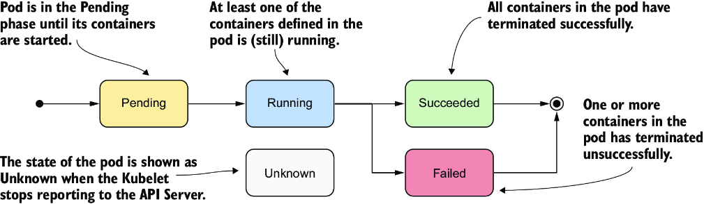
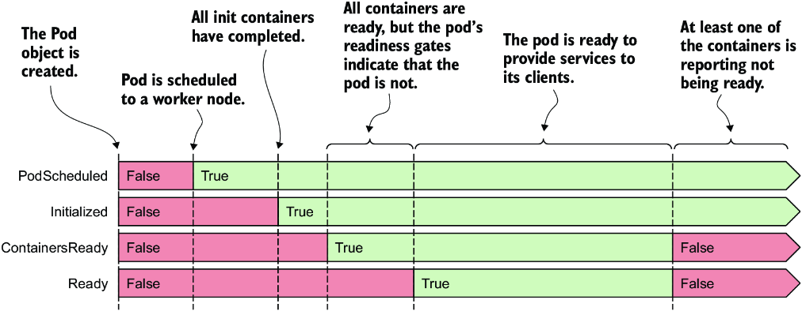
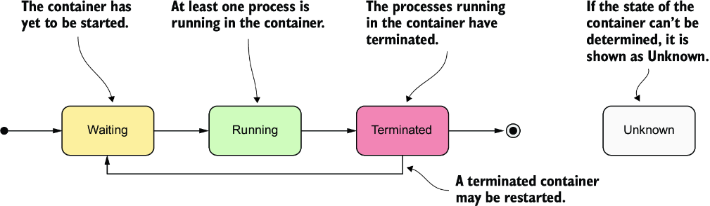
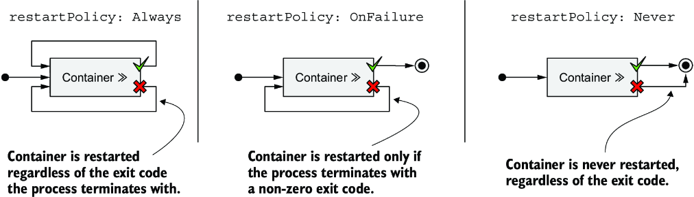
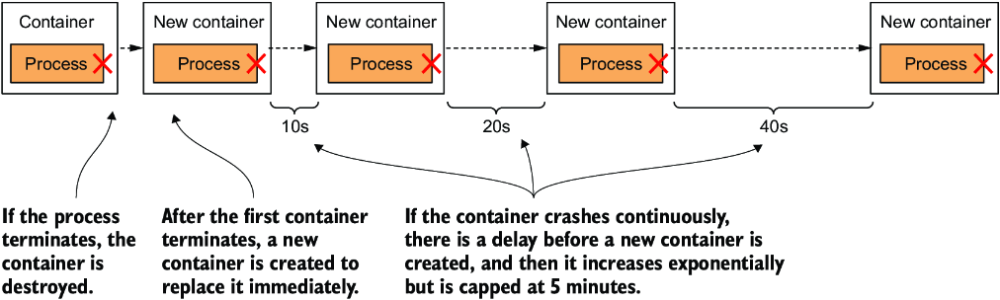
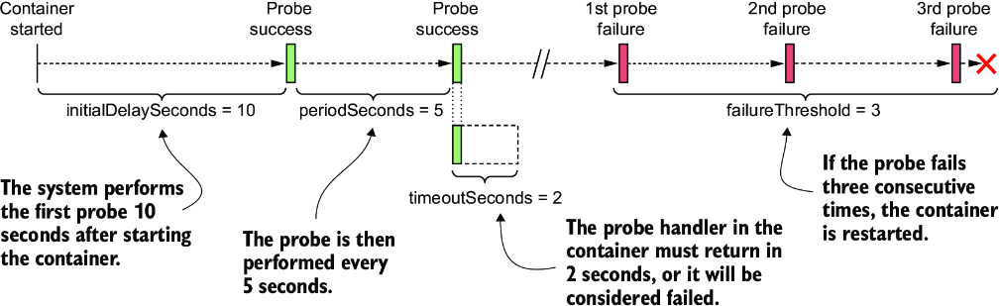
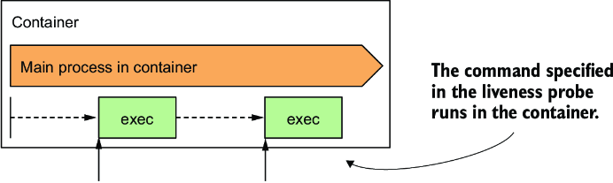

# Managing the Pod Lifecycle and Container Health

## Undestanding Pod's Status

```bash
kubectl -n kiada describe pod kiada -o yaml
```

A pod’s status section contains the following information:

* The IP addresses of the pod and the worker node that hosts it
* The time the pod was started
* The pod’s quality-of-service (QoS) class
* The phase the pod is in
* The conditions of the pod
* The state of its individual containers

The phase and the conditions of the pod along with the states of its container are important in understanding a pod's life cycle.

### Understanding the Pod Phase

The pod’s phase provides a quick summary of what’s happening with the pod.



| Pod phase | Description |
| --- | --- |
| Pending | The initial phase starts after the Pod object is created. Until the pod is scheduled to a node, and the images of its containers are pulled and started, it remains in this phase. |
| Running | At least one of the pod’s containers is running. |
| Succeeded | Pods that aren’t intended to run indefinitely are marked as Succeeded when all their containers complete successfully. |
| Failed | When a pod is not configured to run indefinitely and at least one of its containers terminates unsuccessfully, the pod is marked as Failed. |
| Unknown | The state of the pod is unknown because the Kubelet has stopped reporting communicating with the API server. Possibly the worker node has failed or has disconnected from the network. |

```bash
$ kubectl -n kiada get pod kiada -o yaml | grep phase
phase: Running

$ kubectl describe po kiada
Name:         kiada
Namespace:    default
...
Status:       Running
...

$ kubectl get po kiada
NAME    READY   STATUS    RESTARTS   AGE
kiada   1/1     Running   0          40m
```

^^^For unhealthy pods, the STATUS column indicates what’s wrong with the pod.

### Understanding Pod Conditions

The phase of a pod says little about the condition of the pod. In contrast to the phase, a pod has several conditions at the same time. There are 4 condition types as of now:

| Pod condition | Description |
| --- | --- |
| PodScheduled | Indicates whether the pod has been scheduled to a node. |
| Initialized | The pod’s init containers have all completed successfully. |
| ContainersReady | All containers in the pod indicate that they are ready. This is a necessary but not sufficient condition for the entire pod to be ready. |
| Ready | The pod is ready to provide services to its clients. The containers in the pod and the pod’s readiness gates are all reporting that they are ready. |




**Each condition is either fulfilled or not.**

* `PodScheduled` and `Initialized` conditions start as unfulfilled, but they are soon fulfilled and remain so throughout the life of the pod.

* In contrast, the `Ready` and `ContainersReady` conditions can change many times during the pod’s lifetime.

Each object type has its own set of conditions, for instance a Node Object has – `MemoryPressure`, `DiskPressure`, `PIDPressure`, and `Ready`.

The `Ready` condition is quite generic across all object types which indicates everything is fine with the object.


```bash
$ kubectl describe po kiada
...
Conditions:
  Type              Status
  Initialized       True
  Ready             True
  ContainersReady   True
  PodScheduled      True
...


$ kubectl get po kiada -o json | jq .status.conditions
[
  {
    "lastProbeTime": null,
    "lastTransitionTime": "2020-02-02T11:42:59Z",
    "status": "True",
    "type": "Initialized"
  },
  ...
]
```

The `kubectl describe` command shows only whether each condition is true. To find out why a condition is false, we need to inspect into the pod manifest.

* The `status` field that indicates whether the condition is True, False, or Unknown.

* The condition can also contain a reason field that specifies a machine-facing reason for the last change of the condition’s status, and a message field that explains the change in detail.

* The `lastTransitionTime` field shows when the change occurred, while the `lastProbeTime` indicates when this condition was last checked.

### Understanding the Container Status & State

* `state` field indicates the container’s current state
* the `lastState` field shows the state of the previous container after it has terminated.
* The container status also indicates the internal ID of the container (`containerID`), the image and `imageID` the container is running, whether the container is ready, and how often it has been restarted (`restartCount`).

The most important part of a container's status is its state.



| Container state | Description |
| --- | --- |
| Waiting | The container is waiting to be started. The reason and message fields indicate why the container is in this state. |
| Running | The container has been created, and processes are running in it. The `startedAt` field indicates the time at which this container was started. |
| Terminated | The processes that had been running in the container have terminated. The `startedAt` and `finishedAt` fields indicate when the container was started and when it terminated. The exit code with which the main process terminated is in the `exitCode` field. |
| Unknown | The state of the container couldn’t be determined. |


```bash
$ kubectl describe pod kiada
...
Containers:
  kiada:
    Container ID:   docker://c64944a684d57faacfced0be1af44686...
    Image:          luksa/kiada:0.1
    Image ID:       docker-pullable://luksa/kiada@sha256:3f28...
    Port:           8080/TCP
    Host Port:      0/TCP
    State:          Running
      Started:      Sun, 02 Feb 2020 12:43:03 +0100
    Ready:          True
    Restart Count:  0
    Environment:    <none>
...


$ kubectl get pod kiada -o json | jq .status.containerStatuses
```

## Keeping Containers Healthy

Once the pod object is live, and if the main process in the container terminates for any reason, the Kubelet restarts the container.

### Pod's Restart Policy & Container Restarts

By default, Kubernetes restarts the container regardless of whether the process in the container exits with a zero or non-zero exit code. This behavior can be changed by setting the `restartPolicy` field in the pod’s spec.



The restart policy is configured at the pod level and applies to all its containers.

| Restart policy | Description |
| --- | --- |
| Always | Container is restarted regardless of the exit code the process in the container terminates with. This is the default restart policy. |
| OnFailure | The container is restarted only if the process terminates with a non-zero exit code, which by convention indicates failure. |
| Never | The container is never restarted, not even when it fails. |



* The first time a container terminates, it is restarted immediately.
* The next time, however, Kubernetes waits 10 seconds before restarting it. This delay is then doubled to 20, 40, 80, and then to 160 seconds after each subsequent termination.
* From then on, the delay is kept at 5 minutes. This delay, which doubles between attempts, is called **exponential back-off**.

In the worst case, a container can therefore be prevented from starting for up to 5 minutes.

> The delay is reset to zero when the container has run successfully for 10 minutes. If the container must be restarted later, it is restarted immediately.

```bash
$ kubectl get pod kiada -o json | jq .status.containerStatuses
...
"state": {
  "waiting": {
    "message": "back-off 40s restarting failed container=envoy ...",
    "reason": "CrashLoopBackOff"
```

When a container exits with status code 0, which means it hasn't crashed, so the `CrashLoopBackOff` status can be misleading.

### Liveness Probes

_Liveness Probe_ is a way, kubernetes can ask you application if it is alive and well. It can be defined for each container in the pod.

If the application doesn't respond, an error occurs, or the response is negative, the container is considered unhealthy and is terminated. The container is then restarted if the restart policy allows it.

> Liveness probes can only be used in the pod's regular containers and can't be defined in init containers.

This is helful in scenarios when the application can't catch certain errors by itself like:
* getting stuck into an infinite loop or deadlock.
* OR for example, a Java application with a memory leak eventually starts spewing out `OutOfMemoryErrors`, but its JVM process continues to run. Ideally, Kubernetes should detect this kind of error and restart the container.

#### Types of liveness probes

Kubernetes can probe a container with one of the following three mechanisms:

* An HTTP GET probe sends a GET request to the container’s IP address, on the network port and path you specify. If the probe receives a response, and the response code doesn’t represent an error (i.e., if the HTTP response code is 2xx or 3xx), the probe is considered successful. If the server returns an error response code, or if it doesn’t respond in time, the probe is considered to have failed.

* A TCP Socket probe attempts to open a TCP connection to the specified port of the container. If the connection is successfully established, the probe is considered successful. If the connection can’t be established in time, the probe is considered failed.

* An Exec probe executes a command inside the container and checks the exit code it terminates with. If the exit code is zero, the probe is successful. A non-zero exit code is considered a failure. The probe is also considered to have failed if the command fails to terminate in time.


> In addition to a _liveness probe_, a container can also have a _startup probe_ and a _readiness probe_.


#### Defining an HTTP GET liveness probe

```yaml
spec:
    containers:
    - name: kiada
        image: avr2002/kiada:0.1
        imagePullPolicy: Always   # Values can be Always, IfNotPresent, Never
        ports:
        - containerPort: 8080
        livenessProbe:
        httpGet:
            path: /health
            port: 8080
    - name: envoy
        image: avr2002/kiada-ssl-proxy:0.1
        ports:
        - name: https
        containerPort: 8443
        - name: admin
        containerPort: 9901
        livenessProbe:
        httpGet:
            path: /ready
            port: admin
        initialDelaySeconds: 10
        periodSeconds: 5
        timeoutSeconds: 2
        failureThreshold: 3
```

* For the kiada container, the HTTP GET request is sent to path `/health` (defined in app code) on port 8080. Since no other fields are specified, default settings are used – 
    * The first request is sent 10 seconds after the container starts and is repeated every 5 seconds.
    * If the application doesn’t respond within 2 seconds, the probe attempt is considered failed.
    * If it fails three times in a row, the container is considered unhealthy and is terminated.


    

* For envoy proxy container, the built-in `/ready` endpoint is used. The parameters:

  * `initialDelaySeconds` determines how long Kubernetes should delay the execution of the first probe after starting the container.
  * `periodSeconds` field specifies the amount of time between the execution of two consecutive probes,
  * `timeoutSeconds` field specifies how long to wait for a response before the probe attempt counts as failed.
  * `failureThreshold` field specifies how many times the probe must fail for the container to be considered unhealthy and potentially restarted.

#### Observing liveness probe

* Successful probes are not explicitly reported anywhere expect the application container logs whenever a HTTP GET request on the defined path is handled by it.

* The failed probes can be seen in the kubernetes events.

    ```bash
    $ kubectl -n kiada get events -w
    TYPE     REASON     MESSAGE
    Warning  Unhealthy  Liveness probe failed: HTTP probe failed with code 503
    Warning  Unhealthy  Liveness probe failed: HTTP probe failed with code 503
    Warning  Unhealthy  Liveness probe failed: HTTP probe failed with code 503
    Normal   Killing    Container envoy failed liveness probe, will be restarted
    Normal   Pulled     Container image already present on machine
    Normal   Created    Created container envoy
    Normal   Started    Started container envoy
    ```

To know how a container that fails its liveness probe is restarted, run the kubectl get/describe command to inspect the full manifest

```bash
$ kubectl describe pod kiada
Name:           kiada
...
Containers:
  ...
  envoy:
    ...
    State:          Running
      Started:      Sun, 31 May 2020 21:33:13 +0200
    Last State:     Terminated
      Reason:       Completed
      Exit Code:    0
      Started:      Sun, 31 May 2020 21:16:43 +0200
      Finished:     Sun, 31 May 2020 21:33:13 +0200
    ...
```

The exit code zero shown in the listing implies that the application process gracefully exited on its own. Had it been killed, the exit code would have been 137.

> Note: Exit code 128+n indicates that the process exited due to external signal n. Exit code 137 is 128+9, where 9 represents the KILL signal. You'll see this exit code whenever the container is killed. Exit code 143 is 128+15, where 15 is the SIGTERM signal. You'll typically see this exit code when the container runs a shell that has terminated gracefully.

### exec and tcpSocket Liveness Probe

For applications that don't expose HTTP health-check endpoints, the tcpSocket or the exec liveness probes can be used.

#### tcpSocket Liveness probe

For applications that accept non-HTTP TCP connections, a `tcpSocket` liveness probe tries to open a socket to the TCP port and if the connection is established, the probe is considered a success; otherwise, it’s considered a failure.

```yaml
    livenessProbe:
      tcpSocket:
        port: 1234
      periodSeconds: 2
      failureThreshold: 1
```

Above probe is configured to check whether the container’s network port 1234 is open. An attempt to establish a connection is made every 2 seconds, and a single failed attempt is enough to consider the container as unhealthy.

#### exec Liveness probe

Applications that do not accept TCP connections can use an exec liveness probe. It is a command that is executed inside the container and must therefore be available on the container's file system.



```yaml
    livenessProbe:
      exec:
        command:
        - /usr/bin/healthcheck
      periodSeconds: 2
      timeoutSeconds: 1
      failureThreshold: 1
```

Above example probe runs `/usr/bin/healthcheck` every 2 seconds to determine whether the application running in the container is still alive. If it returns a non-zero exit code or fails to complete within 1 second as specified in the `timeoutSeconds` field, the container is terminated immediately, as configured in the `failureThreshold` field, which indicates that a single probe failure is sufficient to consider the container unhealthy.

